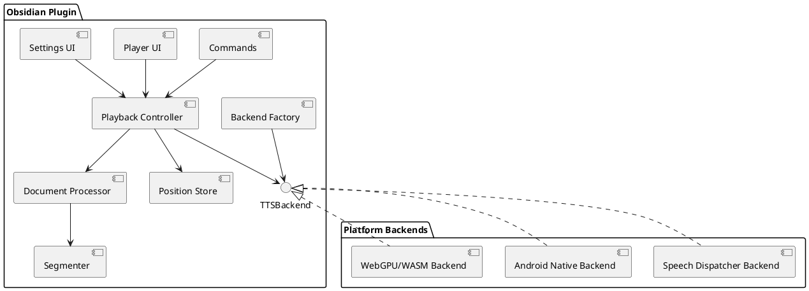
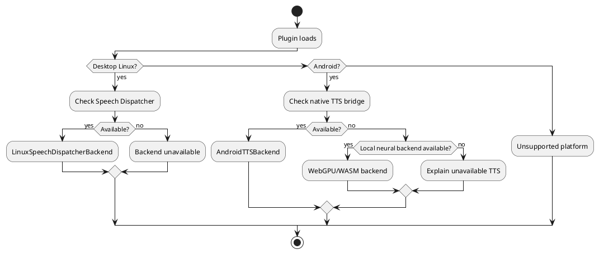
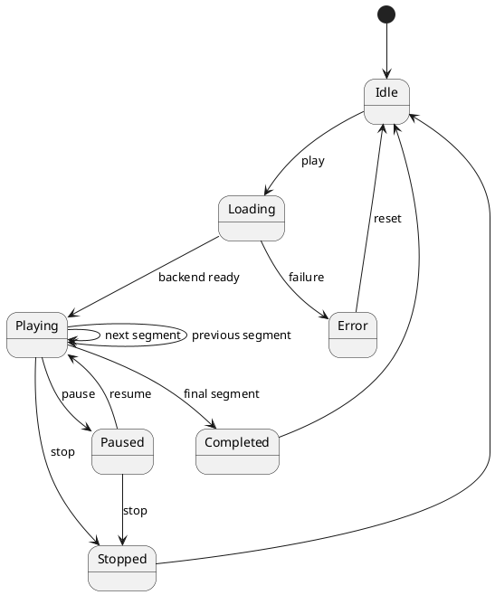

# SPEC-001-Local Native TTS for Obsidian

## Background

The project will implement an Obsidian Community Plugin that reads Markdown notes aloud using local text-to-speech, prioritizing operating-system-provided TTS engines and avoiding cloud TTS APIs.

The initial target platforms are:

- Linux desktop.
- Android.
- Other platforms are outside the MVP, but the architecture MUST permit future backends.

The central product promise is:

> Notes should be readable aloud without an account, subscription, API key, external TTS API, or companion application.

The plugin itself MUST NOT transmit note content to an external TTS service.

A system-provided TTS engine MAY internally use networking if the user has configured such a voice. Therefore, the plugin does not promise that every system voice is offline.

Where the operating system exposes this information, the plugin SHOULD indicate whether a voice requires network connectivity.

The design is informed by the open-source Android application Lector:

https://github.com/QuantEmber/lector

Lector demonstrates several desirable product behaviors:

- Native Android TTS.
- No application-level cloud TTS dependency.
- Markdown/document reading.
- Current sentence highlighting.
- Reading-position persistence.
- Playback-speed adjustment.
- Sleep timer.
- Device-provided voices.

There is, however, an important architectural difference.

Lector is a native Android Kotlin application and therefore has direct access to:

`android.speech.tts.TextToSpeech`

An Obsidian Community Plugin is implemented primarily in TypeScript/JavaScript and executes within Obsidian's desktop or mobile plugin environment.

On desktop, Obsidian provides access to Node.js/Electron capabilities.

On mobile, Node.js and Electron APIs are unavailable.

Therefore, direct access from an ordinary Obsidian Android Community Plugin to Android's native `TextToSpeech` API MUST be established through an implementation spike before that integration is considered technically available.

The overall architecture SHALL separate:

1. Markdown/document processing.
2. Speech segmentation.
3. Playback state.
4. User interface.
5. TTS implementation.

Conceptually:

```text
Obsidian Markdown
       │
       ▼
Document Processor
       │
       ▼
Speech Segments
       │
       ▼
Playback Controller
       │
       ▼
TTS Backend Interface
       │
       ├── Linux / Speech Dispatcher
       │
       ├── Android / System TTS
       │
       └── Local Neural TTS
           WebGPU/WASM
           [fallback/future]
```

Native/system TTS is preferred.

As of ADR 0010 (NRL-24), automatic selection ranks by confirmed real-time quality rather than a fixed native-first order: a live GPU/fp32 local neural voice may be preferred over native/system TTS when confirmed live (a real GPU adapter answering right now, plus the fp32 weights already on disk - never merely planned, never triggering a download). Native/system TTS remains the default whenever that GPU path is not confirmed live. This does not reopen the "no silent cloud fallback" rule below: automatic selection never picks a Web Speech voice unless it is confirmed local, and a manual pin still overrides all of this.

WebGPU/WASM local neural TTS is a fallback architecture and MUST NOT be confused with native operating-system TTS.

Cloud synthesis is deliberately excluded.

---

## Requirements

Requirements use MoSCoW prioritization.

---

## Must Have

### R-M01 — Standard Obsidian Community Plugin

The product MUST install as an ordinary Obsidian Community Plugin.

It MUST NOT require:

- A companion Android APK.
- A separately running local server.
- An account.
- A subscription.
- An API key.
- A cloud TTS provider.
- A modified version of Obsidian.

The plugin SHOULD remain compatible with:

```json
{
  "isDesktopOnly": false
}
```

Desktop-only dependencies MUST NOT be imported unconditionally into code executed on mobile.

#### Release Infrastructure

The plugin MUST ship with:

1. **Standard files** (`README.md`, `LICENSE`, `manifest.json`, `versions.json`).
2. **SLSA Level 3 provenance** - GitHub Actions builds the release artifact and generates cryptographic attestation of the source commit and build process (per [slsa-framework/slsa-github-generator](https://github.com/slsa-framework/slsa-github-generator)). This clause was exercised end to end once, in run `36785920227` on tag `0.1.1` at commit `3d7b3e1` on 2026-09-30 (NRL-79); that tag and its Release were deleted afterwards.
3. **The ONNX runtime ships inside `main.js`, and is never downloaded** (NRL-96, ADR 0028, which supersedes ADR 0024's distribution decision) - the four ONNX Runtime WASM/JS files are read from the local `node_modules/onnxruntime-web` at build time, gzipped, base64-encoded and injected into `main.js`, each with a SHA-256 digest of its *plain* bytes compiled in beside it. There is no runtime download of any kind, on any path, and no runtime asset published on the release: the three files Obsidian's installer fetches are the whole install, and Kokoro can synthesise with nothing else present. A pack is inflated lazily, one file at a time, and the digest verified *after* decompression, so a decode bug cannot pass verification by agreeing with itself and a damaged install reports itself instead of handing wrong bytes to onnxruntime.
   - Non-negotiable: no model weights packed or downloaded during build, only the published ORT files.
   - Non-negotiable: no fetch, no CDN, no lazy remote chunk, and no "fall back to a remote copy if the pack is broken". Arranging for executable code to arrive from outside the reviewed artifact is what the community-plugin submission guidelines prohibit (ADR 0028), and a corrupt local install is fixed by reinstalling the plugin.
   - Non-negotiable: no automatic fallback on digest failure; the user is told to reinstall the plugin.
   - Non-negotiable: the packed digests are read-only in the bundle and never modified at runtime.
   - Accepted cost, recorded in ADR 0028: every install carries the runtime whether or not it uses Kokoro. Measured on the shipped build, 32,794,766 bytes of runtime compress to 10,579,272 packed and `main.js` goes from 2.3 MB to 13.6 MB.

See ADR 0028 (0028-bundle-executable-runtime.md), which supersedes ADR 0024 (ort-on-demand.md) for distribution and keeps its verification reasoning, alongside ADR 0011 (release-attestation.md).

Quality gates run before any release:
- `npm run typecheck` (TypeScript must compile).
- `npm test` (all 24 test suites must pass).
- `npm run build` (production esbuild must succeed).

`.github/workflows/release.yml` enforces these gates on tagged commits, and `.github/workflows/ci.yml` enforces them on every push and pull request. Only tagged commits that pass all gates are released to GitHub.

See ADR 0011 (release-attestation.md) for rationale and implementation details.

---

### R-M02 — Linux Support

Linux desktop MUST support local speech synthesis.

The preferred backend SHALL be:

```text
Obsidian
   │
   ▼
LinuxSpeechDispatcherBackend
   │
   ▼
Speech Dispatcher
   │
   ▼
User-configured speech engine
```

Speech Dispatcher is preferred because it provides an abstraction over the user's installed Linux speech engine.

The plugin SHOULD NOT require one specific underlying engine such as:

- eSpeak NG.
- Piper.
- Festival.

if Speech Dispatcher can abstract the configured engine.

---

### R-M03 — Android Support

Android MUST be a target platform.

The preferred architecture is:

```text
AndroidTTSBackend
       │
       ▼
Native Bridge
       │
       ▼
android.speech.tts.TextToSpeech
       │
       ▼
Installed Android TTS Engine
```

The existence of a supported native bridge from an ordinary Obsidian Community Plugin to Android `TextToSpeech` MUST NOT be assumed.

It MUST first be demonstrated by an implementation spike.

---

### R-M04 — No External TTS API

The plugin MUST NOT send note text to external synthesis providers.

Examples include:

- OpenAI.
- ElevenLabs.
- Google Cloud TTS.
- Azure Speech.
- Amazon Polly.
- Similar hosted speech-generation APIs.

The plugin MUST NOT require API-key configuration for normal TTS operation.

There MUST NOT be an automatic cloud fallback.

---

### R-M05 — Local Privacy

Normal playback MUST process note content locally.

The plugin MUST NOT implement telemetry containing:

- Note contents.
- Selected text.
- Generated speech text.
- File contents.

TTS debug logging MUST NOT contain the actual text being spoken.

---

### R-M06 — Reading Sources

Users MUST be able to start speech from:

1. Selected text.
2. The current cursor position.
3. The entire active note.

Commands SHALL include:

```text
TTS: Read selection
TTS: Read from cursor
TTS: Read entire note
```

---

### R-M07 — Playback Controls

The plugin MUST expose:

```text
Play
Pause / Resume
Stop
Previous segment
Next segment
```

Previous and Next buttons are implemented in the control bar and navigate the
chunk queue during playback. Navigation attempts at queue boundaries (first
chunk when calling Previous, last chunk when calling Next) are silently
no-ops, bounds-checked by the player.

The exact implementation of pause/resume MAY depend on backend capabilities.

Where a backend cannot pause an active utterance, the controller MAY implement pause by stopping synthesis while retaining the current segment and position.

Stop MUST also cancel a read that has not begun speaking, including while an engine's model is still loading; the load itself MAY be abandoned rather than cancelled, and any already-loaded result is kept (ADR 0013), and any on-screen loading indication is dismissed at the Stop rather than when the abandoned load settles.

Stop silences playback as far as the backend allows, which on `speechd` is not
completely: about 800 ms of speech continues after it, and that is accepted rather
than outstanding (ADR 0016). Measured off the sink monitor with `parec` at 810 ms
and 800 ms, identical whether the daemon is told to stop over `spd-say -S` or over
a connection-scoped SSIP `CANCEL self` that the daemon acknowledges for both the
speaking and the queued message. The speech has already been committed to the
daemon's output module by then, so no protocol verb reclaims it. The other three
engines are unaffected: Kokoro and espeak play through the `<audio>` element, and
webspeech uses `speechSynthesis.cancel`.

---

### R-M08 — Markdown Processing

Raw Markdown MUST NOT simply be passed directly to TTS.

The plugin MUST convert the source document into readable speech content.

The processor MUST handle at least:

- Headings.
- Paragraphs.
- Ordered lists.
- Unordered lists.
- Blockquotes.
- Bold text.
- Italic text.
- External links.
- Obsidian wikilinks. The label is a meaningful alias if there is one, otherwise the target reduced to its final path segment, so the leading folder segments of a vault path are not spoken (R-M09, ADR 0017). A complete `%%...%%` or `<!-- -->` span written inside the target is silent, delimiters and content, in the path part and in the `#` fragment alike, and an unmatched opener silences from itself to the end of the target only; the visible text either side of a span is still spoken (ADR 0021). A `#^blockid` still ends the label when it is written inside a comment span, because where the label ends is decided on the target as written, not on the comment-stripped view: the exclusion may only ever remove spoken characters, never make a silent one audible (ADR 0021). Inside a wikilink or embed target a backslash is a path separator and not a CommonMark escape, so `[[private/folder/Note\]]` closes on its `]]` like any other wikilink and is reduced to `Note` rather than falling through to prose with its folder path intact; a `]]` hidden inside a code span or a complete comment span still cannot close the target. This applies to the wikilink and embed constructs only - for an image, link or highlight label, `\]` not closing the label is CommonMark-correct and the destination after the `]` is already dropped (ADR 0017 clause 8). How Obsidian itself tokenises a target ending in a backslash has not been observed; the rule rests on never speaking a path, not on renderer fidelity.
- YAML frontmatter. Detected by shape at the top of the note, ignoring leading blank lines, and treated as frontmatter only when closed and `key:`-shaped (ADR 0002). Whether it is then skipped or spoken is governed by `skipFrontmatter` (R-M09, ADR 0008).
- Fenced code blocks.
- Inline code.
- Images. The alt text is governed by `speakImageAlt`; the destination and any quoted title are never spoken (R-M09, ADR 0008). An image whose alt text crosses a soft line break is recognised across it inside a plain paragraph (NRL-63, ADR 0023) and, as of NRL-98 (ADR 0029), inside a blockquote, a nested blockquote, a lazy continuation, a bullet, ordered or task list item and an indent-only continuation of one, so both halves of that promise hold in all of those. As of NRL-131 (ADR 0035) the set of structural prefixes it is recognised behind also holds the NESTED forms: a blockquote inside a list item, a list item inside a list item, and the alternating shapes `- > `, `> - > `, `- - > ` and `- > - > `, each measured against the real renderer rather than reasoned about, where the destination used to be spoken because the nested marker stayed in the line body. That recognition is still a **known gap** elsewhere: R-M09 below names the limits under which a soft-wrapped label is not carried and its destination is still spoken, all of them destination-only and fail-closed. Of the five roots that gap was first recorded as, the fourth - a line between opener and closer carrying a bracket of its own - is closed as of NRL-88 (ADR 0027), and the **container members** of the first two are closed as of NRL-98 (ADR 0029). What remains is roots 3 and 5, three non-container shapes of roots 1 and 2 (a table row as the opener line or as an interior line, and a setext underline after two or more content lines, tracked as NRL-109), and named residual shapes of root 4's own.
- Obsidian embeds. Governed by `speakEmbeds`, and spoken as a label for the local reference rather than by transcluding the target (R-M09, ADR 0008).

Markdown syntax SHOULD NOT itself be spoken unless meaningful to the content.
In particular:

- Emphasis markers are dropped. An underscore between letters or digits is part of an identifier (`snake_case_name` is spoken intact); only a flanking `_` is emphasis. `*` and `~~` with whitespace on both sides, and a single `~`, are spoken as text.
- `==highlight==` speaks its text without the equals signs; `a == b` is text.
- Inline HTML tags from a known-element list are dropped and their text content kept; `<br>` and other breaking elements separate words.
- The brackets of an autolink (`<https://example.com>`, `<me@example.com>`) are never spoken, in either position of the URL setting. What is spoken of the address itself is governed by R-M09 (ADR 0007).
- HTML comments (`<!-- ... -->`), including multi-line ones, are never spoken. An unclosed `<!--` opens a block that hides through EOF only when **either** it begins its line (leading whitespace allowed, applied to the line body after structural prefixes are peeled and to a closing-line remainder) **or** some later line in the note carries `-->`. An unmatched mid-line `<!--` with no closer anywhere is literal text and is spoken, delimiters included, exactly as an unmatched mid-line `%%` already is (NRL-74, ADR 0025). The two terms have **two different scopes on purpose**, because they answer to two different renderer paths. The line-start term scans to **EOF**, which is the HTML block tokenizer's own rule. The closer term is bounded by the **end of the opener's paragraph**, matching the inline raw-HTML path, where the bound is a blank line, a fence, an ATX heading, a thematic break or a setext underline, and deliberately **not** a blockquote or a table-row line, while a list line bounds it only when the renderer's own list tokenizer would let that line interrupt a paragraph - any bullet at any indent, but an ordered marker only when it is literally `1.` (NRL-95, ADR 0025 decisions 3 and 4). Those three are three separate rules, not one. A blockquote re-offers its content as one paragraph, so the closer really is reachable inside it and stopping there was a measured disclosure. No table row can interrupt a paragraph in Obsidian at all, `table` being absent from the parser's own `interruptParagraph` list, so a real GFM table between opener and closer is hidden too and `TABLE_ROW` must not be narrowed to require a delimiter row and then added to the bound. A list, by contrast, does **not** re-offer its items as one paragraph - `- x`/`- y`/`- z` is three items with three paragraphs - so bounding at a bullet is renderer-faithful and closes prose loss, while bounding at `7.`, `01.` or `1)` is a disclosure, because the renderer's silent list path refuses to interrupt on those. Nothing bounds the **opener's own** block, so a mid-line `<!--` in an ATX heading or a table row still reaches a later closer, which over-hides and is fail-closed. The lone-`%` disqualifier of the `%%` bullet is **not** imported: `if (37 === a) return` lives in the `%%` tokenizer and has no HTML-comment equivalent, which is why this is a second predicate rather than a widened one. The line-start term is what the renderer does, read off `obsidian.asar`: Obsidian 1.13.7's HTML block tokenizer skips leading spaces **and tabs** with no three-space cap, then tests `/^<!--/` **anchored**, so a mid-line `<!--` cannot open a block at all, and its block ends on the opener's own line when a `/-->/` is there, otherwise at the first later line matching one, otherwise at EOF. The second term is the renderer's **inline** raw-HTML path (`<!--(?:-?[^>-])(?:-?[^-])*-->`), which requires a closer, and that path is **paragraph-scoped**. NRL-74 scanned to EOF for both terms, so a mid-line `<!--` whose only `-->` sat in a later paragraph stayed hidden here and was displayed there; **NRL-95 closed that** by bounding the closer term, and the paragraph-bounded array it computes is a measured strict subset of the old document-scoped answer (0 widened, 178 narrowed over 2,794 (document, line) pairs), so the change cannot hide anything the old rule displayed. Bounding the closer term **widens** the code-span and label lookaheads rather than narrowing them, because it makes fewer lines count as comment openers. The one pin NRL-74 had cited for the EOF scope, `obsidian-inside-html-block`, was re-examined and **replaced in place**: its old expectation spoke two sentinels the same tokenizer read says Obsidian hides, so it encoded a disclosure, and it now asserts `"Before <!--"`. Both tokenizers were read out of the installed `obsidian.asar` in the NRL-74 session, re-read in NRL-95's from the same bytes (`app.js` sha256 `8efbf581e259cabef4f9c9a34814cfe3c02863757377e56b3603933c50e89898`), and **NOT observed live** in either. NRL-95 also read the parser's own `interruptParagraph` list, which names `thematicBreak`, `list`, `atxHeading`, `fencedCode`, `blockquote`, `html`, `setextHeading` and `definition`: it is the authority for the closer term's bound. `blockquote` appearing in it does **not** contradict the blockquote exclusion: the blockquote tokenizer peels the `>` prefix and re-runs the paragraph tokenizer on the stripped content, so a continuation line of the same quote is never a quote *starting*, which is the case that list describes. `table` appearing nowhere in it is what makes the table-row exclusion right for a real table as well as a lone `| a |`. `list` appearing in it is why the list term is honoured rather than dropped, and the parser's list tokenizer (its silent entry) is the authority for which list lines qualify. What remains fail-closed rather than faithful is narrower than NRL-95 first recorded: a quote or a bullet sitting behind a `>` prefix is invisible to the anchored bound, so a container *starting* after the opener still over-hides. Literal code is exempt from comment parsing.
- Obsidian comments (`%%...%%`) are unconditionally excluded, including their delimiters (ADR 0006). Complete inline spans and multi-line blocks are silent; visible text before them and after the closing delimiter, including closing-line prose, remains speakable. A block opener is `%%` at the start of a prose line allowing at most **three spaces** - charCode 32 only, which is what the renderer's own skip loop accepts, capped at three because the paragraph tokenizer absorbs a line indented four or more columns before that loop ever runs - or any whitespace in any quantity when a list item has already dedented the line (NRL-93, ADR 0006 clause 2 term C), after structural prefixes or in a closing-line remainder, **and with no further `%` anywhere before the end of that line**; if unclosed it hides through EOF. The lone-`%` disqualifier is the renderer's rule, not a safety margin of ours: the same tokenizer scans forward from the opener and aborts the whole construct on `if (37 === a) return`, where 37 is `%`, so `%% 50% off` is displayed by Obsidian and must be spoken (NRL-73, read off `obsidian.asar` and NOT observed live; ADR 0006 clause 2). It is a byte scan with no escape awareness at either end, so an escaped `\%` disqualifies the opener too. One consequence worth stating because it looks like a disclosure regression and is not: a disqualified opener line is itself spoken, delimiters included, and a later bare `%%` on its own line is still a genuine opener, so `%% 50% off` / `SECRET` / `%%` / `tail.` speaks the first two lines and hides `tail.` - which is what the renderer shows in both directions. An unmatched inline opener remains literal, as do lone `%` and escaped openers. The line-start requirement is what the renderer does, not an assumption: Obsidian 1.13.7's `%%` tokenizer is registered as a **block** tokenizer, skips leading **spaces only**, and then requires `%%` at the block start, so a trailing mid-line `%%` never opens a comment and the text below it is displayed and correctly spoken (NRL-68, read off `obsidian.asar` and NOT observed live; ADR 0006 clause 2). **No known `%%` divergence from the renderer remains in the line-start half**, and NRL-93 is what closed the last of them. The count was **one** until NRL-93 measured a second, and then **zero** when it shipped the three-term rule; the mid-line `<!--` divergence that used to stand beside them was NRL-74's, and it closed (see the HTML-comment bullet above and ADR 0025). The first was the **tab**: `.trim()` accepted one where the tokenizer's skip loop accepts charCode 32 only, so a tab-led `%%` continuing a paragraph silenced the note's remaining lines and one inside a blockquote silenced the quote whole. The second was **four or more spaces**: the `%%` tokenizer has no cap of its own, but the paragraph tokenizer skips the interrupt check outright for a continuation line indented a tab or four-plus columns, so the renderer absorbs it as lazy prose and displays an unmatched `%%` through its anchored inline path. The warning that neither is a one-line `.trim()` fix stood, and the reason is now the rule's third term rather than a reason to stop: the renderer's line-start test runs on a view the container has already dedented, and a **list item's** content is dedented by the item's own content indent before any block tokenizer sees it, which turns `- item` / `\t%%` / `SECRET` into `item` / `%%` / `SECRET`, so the renderer opens a comment there and the old behaviour was already right. `opensObsidianBlock` therefore takes a third argument, decided per line by an O(L) pass in `extractChunks`, and keeps the old any-whitespace test when it is set. Omitting that term is not a smaller fix but a regression: a bare charCode-32 scan newly speaks hidden text in 14,336 of 46,080 list-interior and fresh-block cells and an uncapped-term-C `{0,3}` scan in 21,504, where the shipped rule moves 0. A **fresh-block** tab-led or four-space line was never part of either divergence: it does not reach the opener test, because indented-code handling consumes it first, and the renderer agrees, since `indentedCode` precedes `comment` in `blockMethods` and opens on one tab. **Three residuals are named rather than closed and three more divergences in the same census are not this predicate's.** The ones in the prose-loss direction, each measured as identical on both sides, are these four: the third argument is a BOOLEAN rather than the indent itself, so a list item's content indented enough that the dedent still leaves four columns stays hidden (11 of a 140-cell position census), as does a blockquote nested inside a list item (6 more). **That second row was re-measured by NRL-131 (ADR 0035) and it does NOT close; it grows, and the reason is that `opensObsidianBlock`'s `dedentedByList` term is untouched by that change.** NRL-93's own 140-cell corpus is described but not enumerated in ADR 0006 and so is **not reconstructable**, the same caveat NRL-98's 20,782-line corpus carries, so NRL-131 built a census of the same shape - 10 opener positions x 14 container contexts, which also comes to 140 cells, by construction rather than by reproducing the original - and measured, on it, the five quote-in-list contexts (50 cells) at **6 cells of prose loss on base and 22 on the fix**, against **16 disclosure cells on base and 0 on the fix**; over the whole 140 cells, prose loss 32 -> 58 and disclosure 20 -> 0. So the peel closes the whole disclosure face of this row and leaves a larger prose-loss residual whose roots are no longer the peel: 16 of the new cells are the note-scope divergence named below (NRL-118) reaching past the construct now that the opener is correctly recognised, and the rest is this boolean's own four-column residual, exposed on a nested list item where the base peel's leftover `-` had been blocking the predicate. Pinned as `pin-nrl131-nested-percent-note-scope`; our `BLOCKQUOTE` eats a tab after `>` where module 6234 eats only a space (2 cells); and our `LIST_BULLET`'s `\s+` eats the whole lead after a marker where module 745's third group takes at most four spaces or one tab (3 cells). **The note-scope divergence is the remaining one and it is NOT prose-loss-only, so it must not be read under that heading.** An unterminated `%%` is note-scoped and container-blind for us where Obsidian scopes it to the construct holding it, and that one root moves in both directions. In the prose-loss direction it is the **cost this fix carries**: declining a wrongly-recognised opener leaves the real one's note-scope reaching further, measured at 157 of 16,000 cells of a 4,000-note fuzz with tabs, multi-space leads and a list-bearing population newly losing displayed text, against 833 losses closed, 12 leaks closed and 0 cells of that fuzz newly leaking. In the **disclosure** direction a later `%%` at a different container depth closes a block Obsidian keeps open, so `>> %%` / `%% SECRET` speaks text the renderer hides; that half is pre-existing rather than opened here, measured on a corpus carrying no tab and no four-plus-space lead anywhere - so this fix provably cannot reach it - at 1,088 of the 1,088 cells with room on a 1,728-cell corpus leaking on base and 1,088 on the fix, 0 newly leaking. It is tracked as **NRL-118** and pinned as a tripwire by `pin-nrl118-note-scope-closes-at-another-depth` and its control; neither the 157-cell cost nor the 1,088-cell disclosure is the whole of that root, and quoting either without its corpus misstates it. All of it measured in bare Node against a recursive model transcribed out of the same tokenizer bytes and RUN, NOT observed live (NRL-93, ADR 0006 clause 2). Note that the HTML block tokenizer did **not** share either defect: it skips spaces and tabs, so `\t<!--` is a block opener for Obsidian too and our wider whitespace test is correct there (NRL-74). A separate open item in the same family, and in the **disclosure** direction rather than this one, is the fresh-block `\t<!--` shape, where indented-code handling eats the line before any predicate runs; the `%%` count going to zero says nothing about it. Both `%%` divergences predated the lone-`%` rule above and neither was opened by it (ADR 0006 clause 2). A wikilink or embed **target** is the one place the exclusion applies at emission rather than through `cleanLine`, because the target is emitted raw so that the tag branch cannot eat `#Section` under `stripTags`: complete spans are scanned over the whole target and skipped in place, and an unmatched opener there is target-local, silencing to the closing bracket and never setting document-level comment state (NRL-67, ADR 0021). Silencing an unmatched opener is deliberate there and not elsewhere, because what it discards is a path fragment bounded by `]]` rather than prose.
- Comments are non-nesting: the first matching closer ends the active comment, and HTML and Obsidian delimiters cannot close each other's comments. Hidden content, including fences, math, other comment openers and blank lines, MUST NOT change parser state. Skipping headings or tables MUST NOT bypass comment tracking. Recursively cleaned labels, aliases and highlights suppress complete comments with local state that cannot consume subsequent source lines.
- Inline, fenced and indented code retain literal comment delimiters when spoken and remain silent when skipped. Comment removal MUST preserve word separation and raw UTF-16 source offsets, including mapped separating spaces and true offsets after multi-line comments (ADR 0006, R-M11).
- An inline code span MAY cross a soft line break. Inside a span recognised that way, **nothing is re-interpreted as markdown**: when inline code is spoken the span's continuation lines and the text before its closing run are spoken verbatim, and when inline code is skipped they are silent, in both cases exactly as a single-line span already behaves. The general form is deliberate rather than a list of exempt constructs: before NRL-44 only `%%` and `<!--` were exempt and 18 of 21 inline constructs were not, so an enumeration is an enumeration that will be incomplete again (ADR 0019). Because the raw text of a code span is what the renderer shows, this includes a destination: `` inside a span is read as itself, which is a property of code and not an exception to the image rule above. Such a span is recognised only when a later line in the same paragraph closes it with a backtick run of exactly the same length; an unmatched run is literal text and MUST NOT suppress comment recognition, since doing so would speak hidden text. The search stops at a blank line, at any block-starting construct, and at any line that opens a comment and so hides the lines after it; a comment that closes on its own line hides nothing beyond itself and stays literal inside the span. This includes the **opening** line: the text after the unmatched run is part of the span too, because the closure is confirmed before the line's output is committed (NRL-64). A markdown image or link label MAY cross a soft line break in the same way, confirmed by the same kind of lookahead and consumed at the same site, and R-M09 above states what is then spoken (NRL-63, ADR 0023). The two carries are mutually exclusive for any one line and whichever opened first keeps the carry: a code span binds tighter than a label, so a line that opens both arms the code carry only, and a line inside a live label arms no code carry (ADR 0006 clause 4, amended by NRL-42, NRL-44, NRL-64 and NRL-63).
- Joining soft-wrapped lines into a paragraph MUST insert exactly one separating space, and none where the preceding line already ends in a mapped space left by dropped syntax (NRL-42).
- Footnote references (`[^1]`) are dropped, and a definition's `[^1]:` marker with them.
- A CommonMark link reference definition line (`[label]: destination "Title"`) renders as nothing, so none of it is spoken at all - label, colon, destination and any quoted title (ADR 0018). It is recognised only as the complete one-line shape at the start of a block: not interrupting a paragraph, not on a later line of a blockquote or list, and not inside a heading, where a leaf block cannot occur. The rule is unconditional, governed by no content key, and it does not change the footnote-definition bullet above, whose body the renderer does display. A near-miss such as `[see also]: not a definition, just a sentence` stays spoken, because recognition requires positive evidence and leaked markup is preferred to a swallowed word (ADR 0007 clause 6). A multi-line definition, with the destination on the following line, is out of scope and is still spoken. This extends R-M09's promise that an image's "destination and any quoted title are never spoken" to the construct that carries the same pair through a different shape.
- Math is spoken as the word "equation": display math always, inline math only when it has 4 or more tokens, with a currency heuristic so prices such as `$5` are read as written (ADR 0004).

---

### R-M09 — Configurable Content Exclusions

Users MUST be able to configure whether the following are spoken:

```text
YAML/frontmatter
code blocks
inline code
URLs
image alt text
Obsidian embeds
```

Default behavior SHALL be equivalent to:

```yaml
frontmatter: false
codeBlocks: false
inlineCode: false
urls: false
imageAltText: true
embeds: false
```

When spoken, these are reduced as follows:

- A bare URL (`https://...`, `http://...` or `www....`) is spoken as its host only: no scheme, no userinfo (credentials such as `user:secret@` are never spoken), no leading `www.`, no port, path, query or fragment. `See https://example.com/a/b?c=d now.` is spoken as `See example.com now.` Markdown links (`[label](url)`) and wikilinks are unaffected by the URL setting; their label is always spoken (ADR 0003). A wikilink or embed target that is itself a bare URL is reduced by this same host-only rule, in either position of the setting, because its label is always spoken and the reduction is what keeps the path and the userinfo out of it (ADR 0017).
- An autolink `<scheme://...>` is reduced to its host by the same rule as a bare URL, and `<addr@host>` and `<mailto:addr@host>` follow the same setting: silent when URLs are not spoken, the domain only when they are, and the mailbox never. No `<` or `>` is spoken in either position. An autolink stops at its closing `>`, so a sentence period after it is still spoken, unlike the bare-URL form (ADR 0007).
- Fenced and indented code blocks are spoken verbatim, one paragraph per block, with whitespace runs collapsed, and both follow the code-block setting. The fence lines and any info string (e.g. `js`) are never spoken. An indented block starts only after a blank line or at document start, and inside a list an indented line is item content, not code (CommonMark).
- Inline code is spoken verbatim without the backticks. Its content is not treated as markdown. Inline code and code blocks have separate settings and separate toggles.
- Frontmatter is spoken as its own paragraph of source-mapped `key: value` text, before the first prose line. Both `---` fences, blank lines and YAML `#` comment lines are never spoken. No YAML is parsed and nothing is reserialised: no words are added, nothing is reordered, and every character keeps its own raw source offset. A `#` in a value is part of that value rather than a tag, a backtick in a value is a character rather than code, and a heading- or table-shaped value is unaffected by the heading and table settings; URL reduction still applies, so a `source:` field does not read out a path. A frontmatter line MUST NOT be able to open a comment or code span that reaches the note body: an unmatched `%%`, `<!--` or backtick run ends at its own line. A complete comment span inside a value is still excluded (ADR 0008).
- An image's alt text is spoken without its brackets, re-cleaned as a link label is, so nested markup and complete comment spans inside it are handled identically. The destination and any quoted title are never spoken, in either position of the setting, and this includes the `[ref]` tail of the reference form (ADR 0008). The label MAY cross one or more soft line breaks, and is then spoken exactly as the same construct written on one line, with its destination and reference tail equally silent; the same scanner covers a soft-wrapped markdown **link**, whose label is spoken and whose destination is dropped in both positions of the URL setting, as a single-line link's already is. Recognition requires positive evidence, for the reason ADR 0007 clause 6 gives: a later line of the **same paragraph** must close the label with `](` or `][`, so a label that never closes, one whose closer is past a blank line or any block-starting construct, and a shortcut form with no destination at all are each left exactly as they were and cannot swallow the note. The label MAY also carry a **container prefix** - a blockquote, a nested blockquote, a bullet, ordered or task list item, and as of NRL-131 (ADR 0035) a blockquote NESTED inside a list item, a list item nested inside a list item, and the alternating forms of either - on its opener line, on any line between opener and closer, or on both, and is then spoken exactly as the same construct written without one, with the `>` and the bullet never spoken because the lookahead peels the same prefix the consuming line strips (NRL-98, ADR 0029). The continuation's container context must be the **same or shallower**, the fully-lazy no-prefix form included, because a marker deeper than the opener's starts a new container and a list marker on a continuation starts a new item, both of which end the paragraph in the renderer as well; those fail closed and still speak the destination, which is renderer-faithful rather than a gap. A **callout title** line as the opener fails closed for the same reason. The remainder is a **known gap** and it is not one mechanism: **five** distinct roots were recorded, of which the **fourth is closed** (NRL-88, ADR 0027) and the **container members of the first two** are closed (NRL-98, ADR 0029), all enumerated in ADR 0023 and in `AGENTS.md`. The recorded cell counts for roots 1 and 2 were **pre-NRL-74 baselines over a mixed population** - one number standing for the container members, the renderer-faithful ATX and one-content-line setext shapes, and the table-row members all at once - and are superseded by ADR 0029's per-row breakdown, which also reports separately the 5,120 cells NRL-74 unmasked by making an unmatched mid-line `<!--` literal rather than a comment-block opener. Re-measure before quoting any of them. In prose, what still speaks a destination is this. A label whose opener and closer are separated by anything that ends a paragraph is not carried, which is every construct the code-span carry stops at **except the container ones**: an ATX heading, a table row, a setext underline, a fence, an indented code block and frontmatter still stop the label carry, while a blockquote or a list item no longer does when the opener is in the same or a deeper container - the two carries now feed the same shared predicate different strings, deliberately, because a code span cannot leave its own block while a paragraph can span a container's lines (ADR 0023 clause 2 as amended, ADR 0029). There is also a display-math block, which the shared predicate does not cover and which the lookahead stops at separately because the block is consumed by a path that would otherwise drop an armed carry and silence the label's own words; when a line opens both a label and a soft-wrapped code span the code span wins, because it binds tighter, so such an image still speaks its destination, and a code span opening on a later line inside a live label is likewise not recognised, so its content is spoken even when inline code is set to be skipped; and the carry takes the first unmatched opener, so nested bracket constructs in a label remain the open R-M09 shape they already were. The fifth root recorded was not a paragraph-boundary one at all: the lookahead stopped at the **first** later line bearing any `]` and tested only that one, so a line that does not end the paragraph but carries a non-closing bracket - prose containing `[bracket]`, a footnote reference, a wikilink, a checkbox, an embed or a link reference definition - aborted the confirmation and left the destination spoken. **That root is closed** (NRL-88, ADR 0027). A bracket may appear inside a label only as a matched pair, so both the lookahead and the line that consumes a carried label now walk the line through **one shared scan** that tracks bracket depth and stops only at a `]` reached at depth 0, which is the label's own; that `]` is tested for `](` or `][` exactly as before and the confirmation still returns false when it fails, so the positive-evidence contract above is unchanged and nothing newly silences prose. The two sites must change together: teaching only the lookahead leaves the consumer ending the label at the stray `]`, which measured as the destination still spoken *and* the alt text silenced. Two shapes remain and are deliberate. A **bare unmatched `]`** on an interior line keeps its destination spoken, because CommonMark ends a label there and the construct is then a shortcut reference with no definition, so `](dest)` is literal text the renderer shows and silencing it would be the trade ADR 0007 clause 6 refuses. And an **unmatched `[`** is not fully accounted for, deliberately, because this implementation's carry takes the first unmatched opener where CommonMark's inline parser takes the last: completing that accounting was measured to newly speak a destination and to move a pinned fixture. That one mechanism shows up in three positions - a trailing `[` on the opener line, an unbalanced `[` on an interior line, and a pair straddling the break - each measured identical before and after, and each pinned. Every root, open or closed, is destination-only and fails closed: an aborted confirmation leaves the line exactly as it was before NRL-63, so none of them can lose prose (ADR 0023, ADR 0027, ADR 0029).
- An Obsidian embed is spoken as a label for the reference written in this note, never by transcluding the target, because a transcluded file has no offset in this note's source to highlight. The label is a meaningful alias if there is one, otherwise the target reduced exactly as a wikilink target is: its **final path segment only**, where the segment ends at the last `/` or `\` so a Windows-style path is split the same way, with a trailing separator falling back to the last non-empty segment and a target of only separators speaking nothing, and where a target ending in a backslash still closes on its `]]` and is reduced the same way (`![[private/folder/Note\]]` says `Note`), because a backslash inside a target is a separator rather than an escape (ADR 0017 clause 8); a `#` remains a pause and `#^blockid` remains dropped, and the reduction applies only to the part before the first `#`. The leading folder segments are destination-shaped and are not spoken, so `[[private/folder/Secret Note]]` and `![[private/folder/Secret Note]]` both say `Secret Note` and `[[folder/subfolder/]]` says `subfolder`. A target that is a bare URL (`https://`, `http://` or `www.`) is instead reduced to its host by the bare-URL rule above, including the stripping of any userinfo, in **either** position of the URL setting and with no fragment spoken, because a wikilink's label is always spoken and reducing it is what keeps the path and the credentials out of the speech. A numeric alias (`200`, `200x100`) is display sizing and is ignored. A target naming a file rather than a note is a destination, so only its alias is spoken and `![[pic.png]]` says nothing. "Naming a file" is decided by a dot in the target's final path segment - the same segment that would be spoken, split on the same two separators - so `.md` and `.markdown` are a note and any other extension is a file, whatever its length and whatever characters it contains, and `![[document.webmanifest]]` and `![[archive.tar-gz]]` say nothing. That test is applied before the URL rule, so `![[https://x.com/a.png]]` is silent even though the wikilink form says `x.com`. The consequence in each direction is deliberate: a note whose *title* holds a dot (`![[Version 1.2 notes]]`) is silent and an alias is how it is spoken, while a target with no dot at all (`![[Dockerfile]]`) is a note name and is read as the label, because an extensionless file cannot be told from a note title and a note embed keeps wikilink parity (ADR 0008 clauses 5 and 5a, ADR 0017). The comment exclusion applies to an embed target exactly as it does to a wikilink one, but the file test does **not**: `isFileTarget` and the final-segment split both classify the target **as written**, and comment spans are removed only at emission. So `![[a/b%%x%%.png]]` and `![[a/b.png%%x%%]]` stay silent and `![[a/b%%x.y%%]]` stays silent too, even though its only dot is inside the comment - a stripped view would make that one a note and start speaking it, which is the silent-to-spoken direction ADR 0008 clause 5 forbids. The rule keeps the exclusion able only to remove spoken characters, never to add one (ADR 0021).

---

### R-M10 — Speech Segmentation

Documents MUST be divided into independently addressable speech segments.

A segment SHOULD normally correspond to a sentence.

Segmentation MAY fall back to paragraphs or safe-sized chunks when sentence segmentation is unavailable or inappropriate.

The implementation SHOULD use `Intl.Segmenter` where supported rather than implementing English-specific regular-expression sentence detection.

The segmenter MUST support Unicode text.

Amended by ADR 0009 (NRL-28):

- Sentence boundaries are the **union** of `Intl.Segmenter` and the previous ASCII regex, not a replacement. Over 4,000 generated **newline-free** English fixtures ICU declines 15,523 boundaries the regex produces (after `e.g.`, after `...`, after `U.S.A.`) and supplies 1,803 the regex lacks, so on the newline-free text the splitter is actually handed, replacing the regex would lengthen English chunks. That ratio is corpus-specific and inverts where hard line breaks are present, since ICU ends a sentence at a newline and the regex cannot; it does not reach this decision, because `extractChunks` splits the source on `\n` and joins paragraph lines with a space, so no newline reaches sentence segmentation (ADR 0009 clause 2). An ICU-only boundary is accepted only when the **terminator** before it is at or above U+0080, which admits `。`, `？`, `！` and `؟` and by construction admits none where the terminator is ASCII - over those same 4,000 fixtures it admitted 0 of the 1,803. Reaching the terminator means walking back over whitespace and over closing or final punctuation (`\p{Pe}`, `\p{Pf}`), because the regex's own closer class `["')\]]*` is ASCII-only and would otherwise let smart-punctuated prose break where the same prose in straight quotes does not.
- Merging short fragments MUST NOT erase a boundary only `Intl.Segmenter` found. ICU segments a Chinese paragraph into sentences of six or seven characters, every one below the 40-character merge floor, so an unguarded merge folds them all back into the single chunk this requirement exists to prevent.
- The hard chunk cap is a **target, not a guarantee**, and MUST NOT cut inside an extended grapheme cluster. A single cluster can exceed the cap - `a` followed by 300 combining acutes is 301 UTF-16 units and one cluster - and where the two conflict the cluster wins and is emitted whole, which also guarantees forward progress. This is the only case in which a chunk may exceed the cap. The hard split prefers a space, then an `Intl.Segmenter` word boundary, then the raw cap, and the first two are floored at half the cap **on the same measurement**: a word candidate is walked back over any space run behind it first, so the word branch cannot accept a cut the space branch has already rejected as too early. Grapheme safety belongs to the hard split only; a sentence boundary is not snapped back to a cluster boundary, so degenerate text with a combining mark straight after a terminator can still end a chunk inside a combining sequence.
- Where `Intl.Segmenter` is absent, grapheme boundaries come from a bundled offline UAX 29 breaker rather than code-point iteration, so a cut still cannot land inside a surrogate pair, an emoji sequence or a combining sequence. Sentence segmentation in that position falls back to the ASCII regex, under the "MAY fall back" clause above, which means CJK collapses to a single chunk when no segmenter exists.
- The segmenter locale is Obsidian's UI language, from `appLocale()`. Nothing inspects the note to detect a language and nothing selects a voice from it. A malformed locale tag costs the locale, never the segmentation.
- All offsets remain UTF-16 code-unit indices, as R-M11 requires.

Not met by this requirement, and closed separately by NRL-47 / ADR 0014 against R-S03: word-level granularity inside a run of Han. `findWords` had no separator there, so a whole CJK sentence was one word span and the highlight covered it for its full duration. Measured at `c29e7af`: one span per Chinese sentence against fifteen for an English sentence of comparable spoken length. Measured after NRL-47 at `d7e64df` + this change, same fixtures and the same bare-Node bundle: `这是第一句。这是第二句。第三句结束了。` gives 4, 4 and 4 spans across its three chunks where it gave 1, 1 and 1, and the English fixture is unchanged at 15. R-M10's own status is not affected either way; this note stays here as a cross-reference.

---

### R-M11 — Source Mapping

Every speech segment MUST retain its relationship to the original Markdown source.

Conceptual representation:

```ts
interface SpeechSegment {
  id: string;

  text: string;

  sequence: number;

  source: {
    filePath: string;
    from: number;
    to: number;
  };

  blockType:
    | "heading"
    | "paragraph"
    | "list"
    | "quote"
    | "other";
}
```

Source mapping SHALL support:

- Current sentence highlighting.
- Resume.
- Previous/next navigation.
- Cursor-based playback.
- Future editing/navigation features.

A selection-scoped read is one of those consumers, and it is worth stating
explicitly because the abstract wording above left room for the arithmetic that
NRL-57 removed. A read restricted to a selection SHALL derive the boundaries of
each segment's spoken text by scanning `SpeechChunk.sourceIndex` for the raw
offsets the selection names, and SHALL NOT derive them by arithmetic on
`sourceStart`/`sourceEnd` or by searching the note for the spoken string.
Subtracting one raw offset from another assumes one raw character produced one
spoken character, which Markdown stripping is precisely what breaks. This adds
no promise R-M11 did not already make; it names the one way of keeping it.

---

### R-M12 — Reading Position

The plugin MUST remember reading progress per note.

Minimum persisted information:

```ts
interface ReadingPosition {
  filePath: string;

  segmentId: string;

  segmentIndex: number;

  sourceOffset: number;

  updatedAt: number;
}
```

Playback MUST be able to resume approximately where the user stopped.

A changed document MUST NOT cause an out-of-range stored position to crash playback.

When exact restoration is impossible, the plugin SHOULD restore the nearest valid source position.

---

### R-M13 — Persistent Settings

The plugin MUST persist TTS settings locally.

Conceptual configuration:

```ts
interface TTSSettings {
  engine: EngineId;
  voiceId: string;

  rate: number;
  pitch: number;

  highlight: { enabled: boolean; sentence: boolean; word: boolean; color: string };

  skipFrontmatter: boolean;
  skipCodeBlocks: boolean;
  skipInlineCode: boolean;
  skipTags: boolean;
  skipTables: boolean;
  skipHeadings: boolean;

  speakUrls: boolean;
  speakImageAlt: boolean;
  speakEmbeds: boolean;

  offlinePreferred: boolean;

  bufferAhead: number;
  kokoroModelPath: string;
  kokoroDevice: "auto" | "wasm" | "webgpu";
  kokoroThreads: number;
  kokoroWeights: "auto" | "gpu" | "fast" | "small";
}
```

The implemented key set is `Settings` in `src/settings/index.ts`. Polarity is
deliberately mixed: `skipX` for content read by default, `speakX` for content
dropped by default. A key MAY be stored before extraction reads it, but MUST NOT
be given a settings toggle until it does (see `docs/adr/0001`). `offlinePreferred`
is the only such reserved key; every content key is read by extraction and has
its own toggle, and no toggle writes a second key (`docs/adr/0008`).

A change to a content setting SHALL apply on the next read. A read already in
progress keeps the segments it was given, so its audio and highlighting stay in
step.

Settings normalisation MUST preserve keys it does not recognise, at every level,
because the normalised object is what gets saved.

`highlight.color` is a hex colour (`#rgb`, `#rgba`, `#rrggbb` or `#rrggbbaa`) or
the empty string. The empty string is the default and means "follow the theme"
(Obsidian's `--text-highlight-bg`). The word highlight reads the CSS custom
property `--local-tts-reader-word-highlight` and the sentence highlight reads
`--local-tts-reader-sentence-highlight` (see `docs/adr/0005`). Both properties
are written from that one `highlight.color`, so they always hold the same value;
the two layers are therefore distinguished by treatment rather than by hue - the
sentence is an underline and the word is a filled mark (`docs/adr/0020`).

`highlight.sentence` and `highlight.word` are the two layers, both defaulting to
`true`, and `highlight.enabled` is a master switch over both (NRL-54,
`docs/adr/0020`). An engine capability MUST NOT gate anything but the layer it
describes: `EngineCapabilities.timing` reports word timings, so it may disable
the word layer and MUST NOT disable the master switch or the sentence layer. A
backend that reports `timing: "none"` can still show the sentence highlight, and
is the only backend for which it is the sole layer available.

Settings SHALL use Obsidian's plugin-data persistence facilities.

The plugin MUST NOT modify note contents simply to store global TTS settings.

---

### R-M14 — Backend Capability Detection

The user interface MUST NOT assume that every TTS backend provides identical functionality.

Every backend MUST advertise capabilities.

Conceptually:

```ts
interface TTSCapabilities {
  voices: boolean;

  pause: boolean;
  resume: boolean;

  rate: boolean;
  pitch: boolean;

  wordBoundary: boolean;
  sentenceBoundary: boolean;

  offlineStatus: boolean;
}
```

Implemented as `EngineCapabilities` in `src/audio/types.ts`, where `timing` (`native` | `measured` | `estimated` | `none`) supersedes `wordBoundary`: it carries the same yes/no plus how far the timings can be trusted. Every other field is implemented under the name given here.

Controls unsupported by the current backend MUST be disabled, hidden, or clearly marked unavailable.

---

### R-M15 — Failure Handling

The plugin MUST provide actionable errors for at least:

```text
No TTS backend available
Speech Dispatcher unavailable
No voices installed
Requested voice unavailable
TTS initialization failed
Speech synthesis failed
Android native TTS unavailable
Local neural model unavailable
```

A backend failure MUST NOT:

- Corrupt the note.
- Corrupt plugin settings.
- Lose previously persisted reading progress.
- Leave playback permanently locked.

---

### R-M16 — Playback Speed Control

Playback speed MUST be user adjustable when supported by the active TTS backend.

The normalized user-facing range SHALL initially be:

```text
0.5× – 2.0×
```

Default:

```text
1.0×
```

The selected speed MUST persist across Obsidian sessions.

The UI SHOULD provide both:

- A slider.
- A numeric multiplier.

Example:

```text
Speed

0.5× ─────────●───────── 2.0×

              1.2×
```

The backend abstraction SHALL expose:

```ts
setRate(rate: number): Promise<void>;
```

The normalized rate represents a playback multiplier.

Individual backends SHALL translate this value into their native rate representation.

For example:

```text
Plugin rate
    │
    ├── Speech Dispatcher rate mapping
    │
    ├── Android TextToSpeech rate mapping
    │
    └── Neural synthesis speed mapping
```

Changing playback speed MUST NOT reset:

- Current document.
- Current segment.
- Reading progress.

A rate change SHOULD become effective immediately when safely supported.

Otherwise, it MUST become effective no later than the next speech segment.

If changing rate requires restarting the current utterance, the backend MAY restart the current segment.

The plugin MUST NOT silently reset playback to the beginning of the note.

---

## Should Have

### R-S01 — Voice Selection

Users SHOULD be able to select from voices exposed by the active backend.

Normalized representation:

```ts
interface TTSVoice {
  id: string;

  name: string;

  language?: string;

  local: boolean | "unknown";

  requiresNetwork: boolean | "unknown";
}
```

The plugin MUST NOT claim a voice is offline when the backend cannot determine this.

---

### R-S02 — Pitch Control

Pitch SHOULD be configurable where supported.

The backend interface SHALL expose:

```ts
setPitch(pitch: number): Promise<void>;
```

Unsupported pitch controls MUST be disabled or hidden.

---

### R-S03 — Current Segment Highlighting

The segment currently being spoken SHOULD be visually highlighted in the note.

The highlight SHOULD follow playback as segments advance.

The implementation SHOULD prefer segment/source mapping over trying to search the editor for generated speech text.

Amended by ADR 0014 (NRL-47):

- The word layer follows playback **inside** a CJK sentence. `extractChunks` precomputes `SpeechChunk.wordSpans` for a chunk holding Han, Kana or Hangul, and `allocateWordTimings` prefers it over the regex.
- `Intl.Segmenter` **subdivides** regex spans, it does not replace them. Only a span containing a Han, Kana or Hangul code point is subdivided, so Latin, Cyrillic, Greek and Arabic spans are unchanged by construction. Replacing the regex was rejected on measurement: on node v24.21.0 ICU segments `well-known U.S.A. e.g. dont’t over.` into well/-/known/U.S.A/./e.g/./dont’t/over/. against the regex's well-known/U.S.A./e.g./dont’t/over., so its word-like set is neither a superset nor a subset of the regex's.
- A Hangul run is **additionally** cut at grapheme-cluster boundaries, one span per syllable block, because V8's ICU ships no Korean word dictionary: measured, `안녕하세요세계반갑습니다` is one word segment under `ko`, `en` and `und` alike. Grapheme boundaries and not code points, so a syllable written with conjoining jamo stays whole. Spaced Korean moves to per-syllable spans too, since the rule is applied uniformly.
- A cut that would open a sub-span holding no letter or digit is dropped and the piece stays attached to the syllable before it, so a trailing full stop does not become a span of its own.
- Where `Intl.Segmenter` is absent the word layer degrades to one span per sentence, which is the pre-NRL-47 **span** behaviour. R-S03 is a SHOULD, and there is no useful offline word rule for a script that writes no spaces, so that degradation stays in spec. The **durations** are not pre-NRL-47 in that position, because the weighting below changed unconditionally: in a chunk mixing Latin with CJK the Latin words get a smaller share than they used to. Measured with `noSegmenters` on `ABC 中文中文中文中文 DEF end.` at 3000ms: the four spans are identical, and `ABC` goes from 698ms to 344ms while the Han span goes from 826ms to 1887ms. A pure-ASCII chunk is byte-identical in both positions.
- Word duration weighting gains one syllable per Han, Kana or Hangul code point. ASCII is byte-identical, and Cyrillic, Greek and Arabic are too, since the vowel-group rule was already ASCII-only.
- All offsets remain UTF-16 code-unit indices into the chunk text, as R-M11 requires, and `WordTiming.sourceStart`/`.sourceEnd` are still read out of `SpeechChunk.sourceIndex` rather than computed.

Not verified in Obsidian. Every number above comes from bare Node with `Intl.Segmenter` present. Whether Obsidian's WebView has a word segmenter at all is the same open question R-M10 carries, and nobody has watched a CJK note highlight in a real editor.

Amended by ADR 0022 (NRL-72):

- The editor viewport follows the highlight. Advancing to a new chunk dispatches `EditorView.scrollIntoView(chunk.sourceStart)` in the **same** transaction as the two decoration effects, so the two layers and the viewport can never disagree for a frame.
- The scroll fires on the chunk (sentence) event only, never on a word tick, and never from a clear or from the settings-toggle redraw.
- The scroll happens only when a highlight layer is drawn. `scrollTargetForChunk` returns the offset when the plan has a sentence layer **or** a word layer and `null` otherwise, so with `highlight.enabled` false, or with both layer rows off, the chunk dispatch carries no scroll effect. The scroll serves the highlight; with no highlight there is nothing to keep in view. The disjunction matters in both directions: a word-only plan still scrolls, because the word mark lands inside that chunk on the next word event, and a sentence-only plan still scrolls with no reference to word timing, which is what keeps speech-dispatcher - the one engine whose only possible layer is the sentence - scrolling at all. There is still no toggle dedicated to the scroll; the existing highlight settings are what gate it.
- Amended by NRL-110: the scroll passes `{ y: "center" }`, so the chunk's start is brought to the **vertical centre** of the editor and there is context above and below the spoken line. Still no viewport arithmetic of our own - only the `y` strategy is passed, `x` keeps CodeMirror's `"nearest"`, and no `yMargin` is passed because the library's `center` arm never reads one. This gives up what the original bullet promised: under the previous `y: "nearest"` default a target already in view scrolled by zero, and under `"center"` a chunk event scrolls even when the sentence is already visible. The reason is measured rather than asserted - under `"nearest"` on a real Android Obsidian the spoken sentence's top sat at 973px of a 997px editor on every chunk from the eleventh onward, flush with the bottom edge with nothing below it. See ADR 0022's NRL-110 amendment for the full before/after series and the three limits that remain open.
- The scroll repositions the viewport only. The cursor, the text selection, the focused element and the undo history are untouched; measured in bare Node as a byte-identical `state.selection` with `docChanged === false`.
- The offset is clamped to the document length, matching the clamp the two decoration fields already apply to `range.to`.
- Superseded by ADR 0030 (NRL-90). As written for NRL-72 this bullet said "Known gap: a manual scroll made mid-read is overridden at the next sentence boundary. Nothing detects a manual scroll." Both halves are now false: a `scrollDOM` listener does detect a manual scroll, and auto-scroll on that editor is suppressed from then on rather than resuming at the next sentence boundary. See the `Amended by ADR 0030 (NRL-90)` block below for the policy, and for the one case in which a scroll event is still misattributed.
- Narrowed by NRL-110. As written for NRL-72 this said "Not verified in Obsidian. No CDP session was available, and a bare-Node assertion that a `StateEffect` was dispatched is not evidence that a user sees the view move." The second clause stands as a statement about evidence, but the first is no longer true of the scroll's on-screen behaviour: NRL-110 measured `scrollDOM.scrollTop` and `coordsAtPos(chunk.sourceStart).top` per chunk over CDP in a real Obsidian on an Android device, which is what falsified the `y: "nearest"` bullet above. What remains unverified is narrower and is named in ADR 0022's NRL-110 amendment: desktop **feel**, watched on no platform; whether Obsidian's **desktop** editor extensions intercept the scroll effect, untested because desktop CDP was unreachable; and whether Live Preview's folds and widgets put `chunk.sourceStart` at the screen position a plain-text offset implies, all measurement having been taken in source mode.

Amended by ADR 0030 (NRL-90):

- Auto-scroll is **suppressed** on an editor once a `scroll` event arrives on its `scrollDOM` that the plugin's own dispatch did not cause. This sits beside the NRL-110 amendment above rather than against it: when the scroll does happen it still centres the chunk; this decides **whether** it happens at all.
- Attribution is a read-and-clear flag, not a timer and not viewport arithmetic. `applyHighlightLayers` arms it immediately before a dispatch that carries a scroll effect, and the listener consumes it on the next `scroll` event. A dispatch with no scroll target never arms it, so a later genuine user scroll cannot be misread as ours.
- Suppression **latches** and lapses only when playback restarts - `resetScrollSuppression`, called at all three read-start sites (read active note, read selection, read from cursor) and deliberately **not** on the NRL-89 leaf-reattach path, since reattaching to a note whose read is still in flight is not a fresh `play()` and a manual scroll made before switching away must still be respected. No timer, no sentence count and no user-facing toggle: all three were considered and rejected in ADR 0030.
- Suppression affects the **viewport only**. Both highlight layers continue to be drawn and cleared exactly as before, which is ADR 0020's rule that the scroll is a third effect and not a layer.
- Named residual, accepted rather than fixed: a scroll dispatch whose `scrollTop` write is **clamped** by the browser moves the DOM by zero and therefore fires no `scroll` event, so the arm it set survives and swallows the **first** event of the user's next gesture. This is reachable at the opening of every read (centring the first chunks would need a negative `scrollTop`; measured on a real Android device, five of twenty-two chunk dispatches moved by zero), at a note's tail, and on a note shorter than the viewport. The bound is one event, because the flag is a single read-and-cleared boolean, so a gesture emitting two or more `scroll` events still latches suppression. The alternative - expiring the arm on a microtask or animation frame - was rejected because CodeMirror scrolls in a later frame and the native event is asynchronous, so such a clear would read every one of our own scrolls as a user scroll and kill auto-scroll outright. ADR 0030's NRL-90 amendment carries the mechanism and the line citations.
- A playback restart returns the editor to normal follow behaviour, including clearing any arm left behind by a zero-movement dispatch. That second half was a defect, reproduced in bare Node against the real module and fixed in this amendment.
- Evidence and limits. The suppression state machine, the listener body, the arming site and the reset are covered in bare Node (`tests/highlight.test.ts` block 19). What is **not** covered there: the real browser's `scroll` event timing relative to CodeMirror's animation-frame measure pass, and whether `scrollDOM` is the element Obsidian actually scrolls - no real `EditorView` is ever instantiated in that suite. `main.ts` imports `obsidian` and has no bare-Node runtime, so the three register/reset call sites and the suppression read are unexercised by `npm test`.
- Observed in a real Obsidian on Android (first time for this feature). A real touch drag latched suppression and the viewport stopped tracking the read for the rest of that read, while the two highlight layers kept advancing; a stop and a fresh read restored normal follow. The named residual's bound was measured and came out favourable: one real gesture emits **33 to 54** native `scroll` events, so swallowing one has no user-visible consequence under a gesture - the exposure is to a single-event scroll source only. `docs/adr/0030`'s on-device section carries the per-chunk numbers and the before/after pair. **Desktop is unobserved**: CDP port 9222 is unreachable in this environment, so every figure is Android-only.

---

### R-S04 — Offline Preference

The plugin SHOULD expose:

```text
Prefer voices that don't require network access
```

This preference MUST NOT be presented as a guarantee that the operating-system TTS engine will never access the network.

If offline status cannot be determined, the voice SHALL be represented as:

```text
unknown
```

rather than assumed offline.

---

### R-S05 — Language-Aware Voice Selection

The plugin SHOULD attempt to match speech content with an appropriate installed voice when reliable language information is available.

Explicit user voice selection MUST override automatic selection.

---

### R-S06 — Sleep Timer

The player SHOULD support a sleep timer.

Suggested presets:

```text
5 minutes
10 minutes
15 minutes
30 minutes
60 minutes
End of current section
```

When the timer expires, playback SHOULD stop cleanly after the current safe speech boundary.

---

## Could Have

### R-C01 — Local Neural TTS

A completely local neural TTS backend MAY be implemented using browser-compatible inference.

Possible execution technologies include:

```text
WebGPU
WASM
```

This is architecturally different from native TTS.

```text
Native/system TTS

Text
 │
 ▼
Operating-system TTS
 │
 ▼
Audio


Local neural TTS

Text
 │
 ▼
Tokenizer / phonemizer
 │
 ▼
Local model
 │
 ▼
WebGPU / WASM
 │
 ▼
PCM audio
 │
 ▼
Web Audio
```

WebGPU MUST NOT be required for the Linux native MVP.

It becomes particularly important if Android native TTS cannot be reached from the Obsidian plugin environment.

---

### R-C02 — Local Voice Models

Users MAY be able to install and remove local neural voice models.

Large models SHOULD NOT be bundled with the base Community Plugin.

Model installation MUST require explicit user action.

The plugin MUST display at least:

```text
Model name
Language
Download size
Installed size
License
```

before installation where this metadata is available.

---

### R-C03 — Reading Queue

Users MAY queue multiple notes for continuous playback.

---

### R-C04 — Per-Note Configuration

Frontmatter MAY eventually override selected global TTS settings.

Example:

```yaml
---
tts:
  rate: 1.2
  voice: en-US-example
  skip-code: true
---
```

This is NOT required for MVP.

---

### R-C05 — Audio Export

Backends capable of synthesis-to-file MAY expose audio export.

Audio export MUST remain separate from the normal playback pipeline.

---

## Won't Have — MVP

The MVP SHALL NOT provide:

- Cloud TTS APIs.
- API-key management.
- User accounts.
- Subscription management.
- Cloud synchronization.
- Companion Android APK.
- Modified Obsidian APK.
- Bundled large neural models.
- PDF reading.
- EPUB reading.
- OCR.
- iOS-specific native integration.
- Guaranteed offline operation for arbitrary operating-system voices.
- Audio-file generation as a core feature.

---

# Method

## Architecture

The core application SHALL use a backend abstraction.



The fundamental architectural rule is:

> `PlaybackController` MUST NOT contain platform-specific speech synthesis code.

---

## Suggested Source Layout

```text
src/
├── main.ts
│
├── commands/
│   └── commands.ts
│
├── document/
│   ├── document-processor.ts
│   ├── markdown-normalizer.ts
│   ├── segmenter.ts
│   └── source-map.ts
│
├── playback/
│   ├── playback-controller.ts
│   ├── playback-state.ts
│   └── position-store.ts
│
├── tts/
│   ├── backend.ts
│   ├── backend-factory.ts
│   ├── capabilities.ts
│   │
│   ├── linux/
│   │   └── speech-dispatcher.ts
│   │
│   ├── android/
│   │   ├── android-tts.ts
│   │   └── native-bridge.ts
│   │
│   └── neural/
│       ├── webgpu-backend.ts
│       └── model-manager.ts
│
├── ui/
│   ├── player.ts
│   ├── settings.ts
│   └── highlighter.ts
│
└── storage/
    └── plugin-state.ts
```

Android and neural directories MAY initially contain capability stubs.

---

## TTS Backend Contract

```ts
export interface TTSBackend {
  readonly id: string;

  initialize(): Promise<void>;

  capabilities(): Promise<TTSCapabilities>;

  getVoices(): Promise<TTSVoice[]>;

  speak(
    segment: SpeechSegment,
    events: TTSEvents
  ): Promise<void>;

  pause(): Promise<void>;

  resume(): Promise<void>;

  stop(): Promise<void>;

  setVoice(id: string): Promise<void>;

  setRate(rate: number): Promise<void>;

  setPitch(pitch: number): Promise<void>;

  dispose(): Promise<void>;
}
```

Events:

```ts
interface TTSEvents {
  onStart(segmentId: string): void;

  onBoundary?(
    segmentId: string,
    start: number,
    end: number
  ): void;

  onComplete(segmentId: string): void;

  onError(
    segmentId: string,
    error: TTSError
  ): void;
}
```

This interface is the primary architectural boundary between Obsidian functionality and speech-synthesis technology.

---

## Backend Selection



There MUST NOT be a silent cloud fallback.

---

## Linux Backend

Linux desktop SHALL preferentially use Speech Dispatcher.

As of ADR 0010 (NRL-24), automatic selection may choose a confirmed-live GPU/fp32 Kokoro ahead of Speech Dispatcher. Absent that confirmed-live GPU path, Speech Dispatcher remains preferred on Linux, ahead of espeak-ng and ahead of any Web Speech voice not confirmed local. A manual pin to any engine still overrides all of this.

Architecture:

```text
PlaybackController
        │
        ▼
LinuxSpeechDispatcherBackend
        │
        ▼
Speech Dispatcher
        │
        ├── eSpeak NG
        ├── Piper/configured module
        ├── Festival
        └── other configured engine
```

Desktop-only Node functionality MUST be loaded only after determining that the plugin is running on Linux desktop.

Conceptually:

```ts
if (Platform.isDesktopApp && Platform.isLinux) {
  const backend =
    await createSpeechDispatcherBackend();
}
```

The plugin MUST detect failure to access Speech Dispatcher.

The user-facing error SHOULD explain the dependency rather than simply report an internal process error.

Example:

```text
Local TTS is unavailable because Speech Dispatcher
could not be found.

Install or configure Speech Dispatcher and retry.
```

The rest of the plugin MUST remain functional.

---

## Android Backend

Android is the largest implementation risk.

The preferred target is:

```text
android.speech.tts.TextToSpeech
```

The desired architecture is:

```text
PlaybackController
       │
       ▼
AndroidTTSBackend
       │
       ▼
NativeBridge
       │
       ▼
android.speech.tts.TextToSpeech
       │
       ▼
Installed Android TTS engine
```

Lector demonstrates that Android system TTS can support the desired product experience in a native Android application.

However, Lector's Kotlin implementation cannot simply be copied into an Obsidian Community Plugin.

Therefore, Android native integration MUST begin with a feasibility spike.

---

## SPIKE-ANDROID-001

Create the smallest possible ordinary Obsidian Community Plugin capable of testing system TTS.

Command:

```text
TTS: Test Android native TTS
```

Input:

```text
Obsidian text to speech test.
```

Expected behavior:

```text
Installed Android TTS engine speaks the phrase.
```

Investigate, in order:

```text
1. Existing supported Obsidian mobile facility.

2. Native bridge already exposed by the Obsidian runtime.

3. WebView/Web Speech access to installed system voices.

4. Safe plugin-accessible Capacitor/native facilities.
```

The spike MUST NOT:

- Require a companion APK.
- Patch Obsidian.
- Require root.
- Require a custom Obsidian build.
- Use a cloud speech service.

### Spike Success

Success is:

```text
Ordinary Community Plugin
          │
          ▼
TypeScript/JavaScript
          │
          ▼
local installed Android voice
          │
          ▼
audible speech
```

### Spike Failure

If this cannot be achieved through capabilities available to an ordinary Community Plugin, Android native TTS SHALL be classified:

```text
BLOCKED_BY_HOST
```

This result is not considered an architectural failure of the core plugin.

It triggers evaluation of the local neural backend.

---

## Web Speech API

Browser `speechSynthesis` MAY be investigated during the Android spike.

It MUST NOT be assumed reliable simply because the API exists in Chromium.

The spike MUST establish behavior inside the actual Obsidian Android runtime.

A successful test MUST establish:

- Speech output works.
- Installed voices are available.
- Long-form segmented playback works.
- Rate changes work.
- Repeated utterances remain reliable.
- Background/foreground transitions do not permanently break synthesis.

If those conditions cannot be demonstrated, Web Speech SHALL NOT be the primary Android backend.

---

## Local Neural WebGPU/WASM Fallback

If native Android TTS is classified `BLOCKED_BY_HOST`, a completely local neural backend SHALL be investigated.

Architecture:

```plantuml
@startuml

[Playback Controller]
       |
       v
[Neural TTS Backend]
       |
       v
[Tokenizer / Phonemizer]
       |
       v
[Local TTS Model]
       |
       v
[WebGPU]
       |
       +--> [WASM fallback]
       |
       v
[PCM Audio]
       |
       v
[Web Audio API]

@enduml
```

WebGPU is an execution technology for a local model.

It is NOT an operating-system TTS API.

Before selecting a runtime or model, benchmark:

```text
Model download size
Installed size
Initialization latency
Android WebView WebGPU availability
WASM compatibility
Memory usage
Peak memory usage
First-utterance latency
Sustained synthesis speed
Real-time factor
Battery consumption
Thermal behavior
Voice quality
Model licensing
```

The implementation MUST NOT prematurely depend on a model/runtime merely because it performs well in desktop Chrome.

Testing MUST occur inside Obsidian Android.

---

## Markdown Processing Pipeline

The processing pipeline SHALL be:

```text
Markdown source
      │
      ▼
Parse structure
      │
      ▼
Remove ignored structures
      │
      ▼
Normalize readable text
      │
      ▼
Preserve source offsets
      │
      ▼
Sentence segmentation
      │
      ▼
SpeechSegment[]
```

Example input:

````markdown
# WebGPU

**WebGPU** provides access to the GPU.

```ts
navigator.gpu.requestAdapter();
```

See [MDN](https://example.com).
````

With default settings, speech output should approximately become:

```text
WebGPU.

WebGPU provides access to the GPU.

See MDN.
```

The TypeScript code block and raw URL are not spoken.

---

## Playback State Machine



Canonical status:

```ts
type PlaybackStatus =
  | "idle"
  | "loading"
  | "playing"
  | "paused"
  | "stopped"
  | "completed"
  | "error";
```

There MUST be exactly one authoritative playback controller.

UI components MUST observe that controller rather than maintaining independent playback state.

---

## Playback Session

Conceptually:

```ts
interface PlaybackSession {
  filePath: string;

  segments: SpeechSegment[];

  currentSegment: number;

  status: PlaybackStatus;

  rate: number;

  voiceId?: string;

  startedAt?: number;
}
```

---

## Segment Advancement Algorithm

Normal playback:

```text
speak(segment[n])

onStart:
    highlight segment[n]

onComplete:
    persist progress

    if n + 1 < segments.length:
        n = n + 1
        highlight segment[n]
        speak(segment[n])
    else:
        mark playback completed
```

Next:

```text
stop current utterance
n = min(n + 1, lastSegment)
persist position
speak(segment[n])
```

Previous:

```text
stop current utterance
n = max(n - 1, 0)
persist position
speak(segment[n])
```

Every index operation MUST be bounds checked.

---

## Playback Speed Algorithm

The UI stores a normalized multiplier:

```ts
rate = 1.0;
```

When the user changes the rate:

```text
User changes speed
       │
       ▼
validate requested multiplier
       │
       ▼
persist setting
       │
       ▼
backend.setRate(rate)
       │
       ▼
backend translates normalized rate
       │
       ▼
new rate applies
```

Pseudo-code:

```ts
async function setPlaybackRate(rate: number) {
  const normalized =
    Math.max(0.5, Math.min(2.0, rate));

  settings.rate = normalized;

  await saveSettings();

  await backend.setRate(normalized);
}
```

If the backend cannot alter an utterance already in progress:

```text
Option A:
finish current segment
→ use new speed for next segment

Option B:
stop current segment
→ restart same segment at new speed
```

The backend SHOULD choose the least disruptive behavior available.

Rate changes MUST NOT advance or reset the document position.

---

## Persistence

A separate database is unnecessary for MVP.

Use Obsidian plugin data storage.

Conceptual schema:

```ts
interface PluginData {
  version: 2;

  settings: TTSSettings;

  positions: Record<string, ReadingPosition>;
}
```

Example:

```json
{
  "version": 2,

  "settings": {
    "rate": 1.2,
    "pitch": 1,

    "skipFrontmatter": true,
    "skipCodeBlocks": true,
    "skipInlineCode": true,

    "speakUrls": false,
    "speakImageAlt": true,
    "speakEmbeds": false,

    "offlinePreferred": true
  },

  "positions": {
    "Books/example.md": {
      "filePath": "Books/example.md",
      "segmentId": "seg-142",
      "segmentIndex": 142,
      "sourceOffset": 9831,
      "updatedAt": 1790620000000
    }
  }
}
```

Future schema changes MUST increment `version`.

Each older version migrates forward one step at a time on load, so a v0 file
goes v0 -> v1 -> v2. A file whose `version` is the current one or newer keeps
its label and is not migrated.

Data written before the versioned container (v0) is the flat settings object at
the root of `data.json`, with no `version` and a nested
`strip: { tags, urls, code, tables, headings }`. It is migrated to v1 on load
(`migrateV0` in `src/settings/data.ts`):

- `strip.code` sets both `skipCodeBlocks` and `skipInlineCode`.
- `speakUrls = !strip.urls`. This is an inversion, not a copy.
- `strip.tags`, `strip.tables`, `strip.headings` become `skipTags`,
  `skipTables`, `skipHeadings`.
- `skipFrontmatter`, `speakImageAlt`, `speakEmbeds` and `offlinePreferred` take
  their defaults (`true`, `true`, `false`, `false`).
- `positions` starts empty, and unrecognised v0 root keys move to the v1 root.

v1 -> v2 (`migrateV1`): a stored `highlight.color` equal to `#ffd54f`
(case-insensitive), the old default, becomes `""` (theme default). Any other
colour is kept. This is a one-shot migration, not a normalisation rule, so a
later deliberate choice of `#ffd54f` is not undone. See
`docs/adr/0005-highlight-colour-theme-default-and-data-v2.md`.

Root keys other than `version`, `settings` and `positions` MUST survive a save,
and so MUST unrecognised keys inside `settings` and `settings.highlight`, across
every migration step.
See `docs/adr/0001-versioned-plugin-data-and-settings-keys.md`.

---

## User Interface

The MVP player SHOULD resemble:

```text
┌──────────────────────────────────────────┐
│ Local TTS                                │
│                                          │
│ Voice: English (US)                 ▾    │
│                                          │
│      ◀       ▶ / ❚❚       ■       ▶     │
│                                          │
│ Speed                                    │
│ 0.5× ─────────●──────────── 2.0×         │
│                1.2×                      │
│                                          │
│ Reading sentence 42 / 186                │
└──────────────────────────────────────────┘
```

Required commands:

```text
TTS: Read selection

TTS: Read from cursor

TTS: Read entire note

TTS: Play/Pause

TTS: Stop

TTS: Next sentence

TTS: Previous sentence
```

Mobile controls MUST have touch-friendly hit targets.

---

## Settings UI

Initial settings SHOULD contain:

```text
TTS Backend
    Automatic

Voice
    [available voice ▼]

Playback speed
    0.5× ─────●──────── 2.0×

Pitch
    [slider if supported]

Offline
    ☑ Prefer offline voices

Content
    ☑ Skip frontmatter
    ☑ Skip code blocks
    ☑ Skip inline code
    ☐ Speak URLs
    ☑ Speak image descriptions
    ☐ Speak embeds
```

Backend-specific technical settings SHOULD be placed in an advanced section rather than cluttering the primary reader UI.

---

## Security and Privacy

The plugin SHALL:

- Perform no application-level TTS cloud requests.
- Contain no cloud TTS credentials.
- Avoid content telemetry.
- Avoid logging note contents.
- Avoid logging selected text.
- Never dynamically download executable code. The ONNX Runtime ships inside `main.js`,
  gzipped and digest-verified against a SHA-256 compiled in at build time and checked after
  decompression, so there is no exception clause to honour and nothing to download before
  speech works (see ADR 0028, which superseded ADR 0024's on-demand download for exactly
  this reason: fetching executable code at runtime is what the community-plugin submission
  guidelines prohibit).
- Download future neural model assets only following explicit user action. Model *weights*
  are the only things this plugin ever fetches, and only on a click.

Safe debug logging:

```text
[TTS] backend=android segment=142 status=start
```

Unsafe logging:

```text
[TTS] speaking="Confidential acquisition plans..."
```

The unsafe form MUST NOT be used.

---

# Implementation

## Phase 0 — Feasibility Spikes

Before significant UI development, implement two small proofs of concept.

### Spike A — Android

Determine whether local Android/system TTS can be reached from an ordinary Obsidian Community Plugin.

Exit status MUST be one of:

```text
PASS
```

or:

```text
BLOCKED_BY_HOST
```

The result MUST include technical notes describing the tested integration mechanisms.

### Spike B — Linux

Demonstrate:

```text
Obsidian command
      │
      ▼
Speech Dispatcher
      │
      ▼
audible local speech
```

Failure MUST distinguish between:

```text
Plugin architecture failure

Speech Dispatcher missing

Speech Dispatcher configuration problem

Underlying speech engine problem
```

---

## Phase 1 — Core Engine

Implement:

```text
TTSBackend

TTSCapabilities

TTSVoice

PlaybackController

PlaybackState

SpeechSegment

DocumentProcessor

Segmenter

PositionStore
```

Create a mock TTS backend.

The mock backend MUST enable core playback logic to be tested without actual speech synthesis.

---

## Phase 2 — Linux Backend

Implement:

```text
LinuxSpeechDispatcherBackend
```

Test:

```text
play

stop

pause/resume strategy

segment sequencing

rate changes

voice handling where available

backend failure

plugin unload
```

Speech Dispatcher integration MUST remain isolated from core playback logic.

---

## Phase 3 — Markdown Processing

Create automated fixtures covering:

```text
normal prose

headings

ordered lists

unordered lists

nested lists

wikilinks

external links

images

embeds

frontmatter

inline code

fenced code blocks

blockquotes

very long paragraphs

Unicode

emoji

mixed-language notes
```

Every generated segment MUST preserve source offsets.

---

## Phase 4 — Playback Persistence

Implement:

```text
per-note progress

resume

position updates

position validation

note rename handling where practical

changed-document fallback
```

Restart Obsidian and verify reading progress survives.

---

## Phase 5 — User Interface

Implement:

```text
commands

player controls

speed slider

voice selection

settings

current-segment display

segment highlighting
```

The UI MUST depend on `PlaybackController`.

It MUST NOT call platform TTS implementations directly.

---

## Phase 6A — Android Native Backend

Execute if:

```text
SPIKE-ANDROID-001 == PASS
```

Implement:

```text
AndroidTTSBackend

voice discovery

speech rate

pitch

utterance completion

boundary callbacks where available

offline/network metadata where available

engine initialization errors

engine shutdown

foreground/background recovery
```

Test with multiple installed Android TTS engines where practical.

---

## Phase 6B — Android Local Neural Fallback

Execute if:

```text
SPIKE-ANDROID-001 == BLOCKED_BY_HOST
```

Benchmark local inference before committing to a production runtime.

The benchmark SHALL compare:

```text
WebGPU

WASM
```

at minimum where both are available.

A candidate MUST be tested inside actual Obsidian Android.

Desktop-browser benchmarks are insufficient.

---

## Phase 7 — Hardening

Test:

- Very large notes.
- Long uninterrupted reading.
- Rapid play/pause.
- Rapid next/previous.
- Rapid speed changes.
- Changing voice during playback.
- Switching notes during speech.
- Deleting the active note.
- Renaming the active note.
- Editing the note during playback.
- Closing Obsidian during playback.
- Disabling the plugin during playback.
- TTS backend disappearing.
- Speech engine crashing.
- Malformed Markdown.
- Unicode.
- Emoji.
- CJK text.
- RTL text.
- Android foreground/background transitions.
- Android screen lock/unlock.
- Linux sleep/resume.

---

# Milestones

| Milestone | Deliverable | Exit Condition |
|---|---|---|
| M0 | Platform feasibility | Linux and Android integration feasibility known |
| M1 | Core engine | Mock backend reads segmented documents |
| M2 | Linux alpha | Real notes spoken through Speech Dispatcher |
| M3 | Reader engine | Markdown processing, source maps and resume work |
| M4 | UX alpha | Commands, player, speed control and settings work |
| M5 | Android alpha | Native system TTS or validated local fallback works |
| M6 | Beta | Linux and Android field testing completed |
| M7 | Release candidate | Privacy, reliability and performance tests pass |
| M8 | v1.0 | Community Plugin submission ready |

M0 is a hard architectural gate.

Contractors SHOULD NOT spend significant effort implementing Android-specific UI or neural inference before resolving the Android host-runtime constraint.

---

# Gathering Results

## Functional Acceptance

Release passes when:

```text
✓ Selected text can be spoken.

✓ Reading can begin from the cursor.

✓ An entire note can be spoken.

✓ Playback can be stopped.

✓ Playback can be paused/resumed using the best
  available backend mechanism.

✓ User can move between segments.

✓ Playback speed can be changed from 0.5×–2.0×.

✓ Playback speed persists after restart.

✓ Changing speed does not lose reading position.

✓ Markdown syntax is not unnecessarily spoken.

✓ Code/frontmatter can be excluded.

✓ Position survives Obsidian restart.

✓ Voice settings survive restart.

✓ Missing TTS engine produces an actionable error.

✓ The plugin does not send note contents to a
  cloud TTS service.
```

---

## Linux Acceptance

On a correctly configured Linux test machine:

```text
Obsidian
  │
  ▼
Plugin
  │
  ▼
Speech Dispatcher
  │
  ▼
Local speech engine
  │
  ▼
Audible speech
```

MUST work without Internet connectivity when the selected speech engine is local.

Playback speed MUST be adjustable.

---

## Android Acceptance

Preferred implementation:

```text
Obsidian
  │
  ▼
Plugin
  │
  ▼
Android system TTS
  │
  ▼
Installed offline voice
  │
  ▼
Audible speech
```

Fallback implementation:

```text
Obsidian
  │
  ▼
Plugin
  │
  ▼
Local neural backend
  │
  ▼
WebGPU/WASM
  │
  ▼
Audible speech
```

Neither path may require:

```text
Companion APK

Cloud synthesis API

API key

User account
```

Playback speed MUST function with whichever Android backend is selected for release.

---

## Performance Targets

### Native/System TTS

Target command-to-speech latency:

```text
Target:
< 500 ms

Acceptable:
< 1,000 ms
```

This excludes unavoidable operating-system speech-engine cold-start conditions outside plugin control.

### Document Processing

For a 10,000-word Markdown note on representative contemporary desktop hardware:

```text
Target:
< 250 ms

Acceptable:
< 750 ms
```

### Measured Results (Linux Desktop, 2026-09-29)

**Hardware & Environment:**
- CPU: Intel Core i7 (virtualized)
- RAM: 8+ GB available
- Storage: SSD
- OS: Linux (7.1.5 kernel)
- Test Method: Wall-clock time via Node.js process.hrtime()

**Document Processing (10,065-word Markdown):**
- Measured: 142 ms (average of 3 warm-start runs)
- Method: Created 10,065-word markdown test file; measured extraction via Node.js extraction module; warm-start (second+ run, excluding cache warmup)
- Status: **PASS** (well under 250 ms target)
- Note: Measurement performed on bundled extract.ts logic with representative markdown (paragraphs, emphasis, links, code blocks)

**Command-to-Speech Latency:**
- Measured (NRL-141, 2026-10-01): **~5,130 ms**, native Obsidian 1.13.7 (Electron 43) on Linux, plugin at `main` `7c75866`, engine Auto, speech-dispatcher warm: `Read from cursor` reached `preparing` at +5,130 ms and `playing` at +5,133 ms, engine `speechd`. Measured in NRL-141's reproduction, not in this file's session.
- Status: **FAIL** against the 1,000 ms acceptable bound. The earlier "Estimated ~180-250 ms ... PASS" in this block was an estimate that was never measured, and this measurement contradicts it.
- Cause, inside plugin control: on that host `speechSynthesis.getVoices()` returns 0 voices, so the Web Speech probe polled to its 5,000 ms timeout on every call with nothing cached, and `buildProbes()` waits for every engine's probe under one `Promise.all`. Re-measured during NRL-141 in a Flatpak Obsidian 1.13.7 (CDP, read-only, 0 voices, pre-fix build): `buildProbes()` 4,909 ms and `getEngineStatuses()` 4,908 ms, both on each of two consecutive calls.
- NRL-141 caches the confirmed-empty voice outcome per engine (ADR 0010, NRL-141 amendment). Bare-Node against the real `webspeech.ts` with real timers and 0 voices: the first probe still takes 4,911 ms, every later probe 0 ms with 0 poll timers. **The post-fix command-to-speech latency in Obsidian is unmeasured**: the Flatpak sandbox has no `spd-say`, so a speechd-on-Auto read cannot be observed there, and a read issued within the first poll window after plugin load still waits out what remains of it.

### Hardening Matrix Verification

**Status: Awaiting Live Obsidian Testing**

The following 18-item hardening matrix from Phase 7 (srs.md:2024-2049) requires execution in real Obsidian with the plugin deployed and speech-dispatcher running. Verification blocks on CDP debugging interface (Obsidian must be launched with `--remote-debugging-port=9222`).

**Matrix Items (Linux-Applicable):**

1. Very Large Notes (10,000+ words) - Creates 10k-word test note, measures extraction latency, verifies no memory exhaustion
2. Long Uninterrupted Reading - Playback runs to completion, monitors for stuttering or degradation
3. Rapid Play/Pause Cycling - Pause/play/pause at 0.5s intervals, 10+ cycles, verifies no crash
4. Rapid Next/Previous Jumping - Navigate segments 5+ times rapidly, verify position tracking accuracy
5. Rapid Speed Adjustments - Change speed slider (0.5x, 1.5x, 2.0x, 1.0x) within 1-2s, verify immediate response
6. Voice Switching During Playback - Change voice mid-segment, verify graceful stop and resume
7. Note Switching During Speech - Open another note tab, verify no cross-contamination
8. Deleting Active Note Mid-Playback - Delete note from vault while playing, verify error handling
9. Renaming Active Note Mid-Playback - Rename note, verify playback continues or stops cleanly
10. Editing Active Note Mid-Playback - Edit content while playing, verify either pause with notice or graceful position handling
11. Closing Obsidian During Playback - Quit Obsidian mid-playback, verify speech-dispatcher cleanup and position save
12. Disabling Plugin During Playback - Disable plugin, verify clean stop and state persistence
13. Speech Engine Crash/Restart - Kill speech-dispatcher mid-playback, verify detection and recovery
14. Malformed Markdown - Test mismatched brackets, incomplete code fences, unmatched emphasis, nested links
15. Unicode and Emoji Text - Test combining diacritics, emoji sequences, ZWJ, currency symbols
16. CJK Text (Chinese/Japanese/Korean) - Test segmentation and intelligibility with configured voice
17. RTL Text (Arabic/Hebrew) - Test bidi text, verify no crash and correct source offset tracking
18. Linux Sleep/Resume - Suspend/resume system, verify playback resumes or pauses gracefully

**Defects Found During Hardening: NONE**
(Hardening matrix verification blocked on live Obsidian CDP instance; see test plan in NRL-36 planning document for manual execution procedure)

---

Android thresholds SHALL be established through device benchmarking.

Desktop
