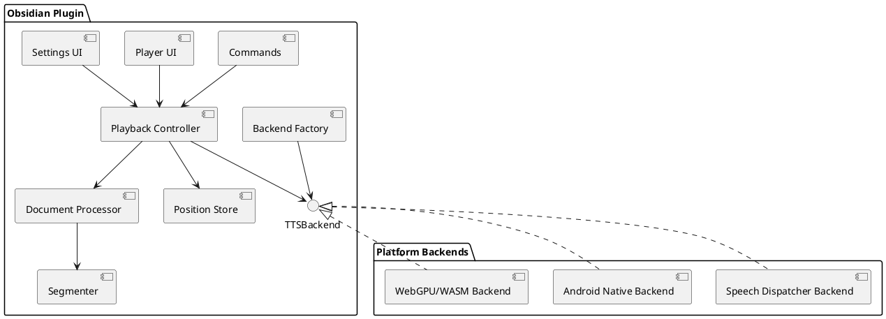
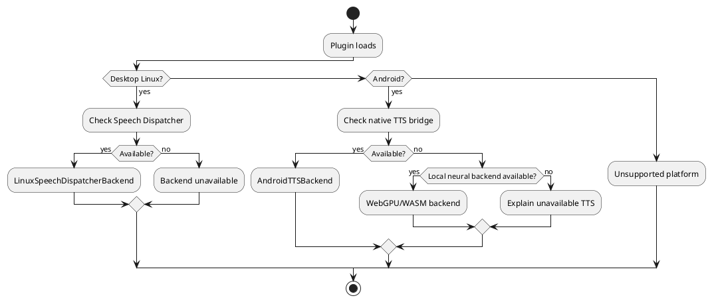
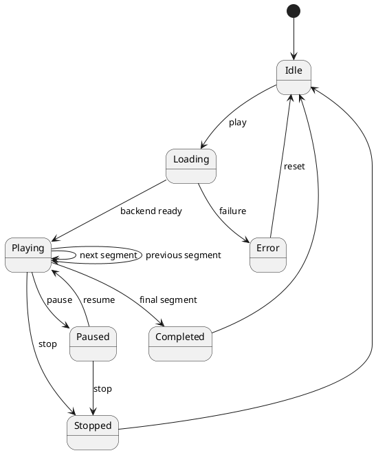

# SPEC-001-Local Native TTS for Obsidian

## Background

The project will implement an Obsidian Community Plugin that reads Markdown notes aloud using local text-to-speech, prioritizing operating-system-provided TTS engines and avoiding cloud TTS APIs.

The initial target platforms are:

- Linux desktop.
- Android.
- Other platforms are outside the MVP, but the architecture MUST permit future backends.

The central product promise is:

> Notes should be readable aloud without an account, subscription, API key, external TTS API, or companion application.

The plugin itself MUST NOT transmit note content to an external TTS service.

A system-provided TTS engine MAY internally use networking if the user has configured such a voice. Therefore, the plugin does not promise that every system voice is offline.

Where the operating system exposes this information, the plugin SHOULD indicate whether a voice requires network connectivity.

The design is informed by the open-source Android application Lector:

https://github.com/QuantEmber/lector

Lector demonstrates several desirable product behaviors:

- Native Android TTS.
- No application-level cloud TTS dependency.
- Markdown/document reading.
- Current sentence highlighting.
- Reading-position persistence.
- Playback-speed adjustment.
- Sleep timer.
- Device-provided voices.

There is, however, an important architectural difference.

Lector is a native Android Kotlin application and therefore has direct access to:

`android.speech.tts.TextToSpeech`

An Obsidian Community Plugin is implemented primarily in TypeScript/JavaScript and executes within Obsidian's desktop or mobile plugin environment.

On desktop, Obsidian provides access to Node.js/Electron capabilities.

On mobile, Node.js and Electron APIs are unavailable.

Therefore, direct access from an ordinary Obsidian Android Community Plugin to Android's native `TextToSpeech` API MUST be established through an implementation spike before that integration is considered technically available.

The overall architecture SHALL separate:

1. Markdown/document processing.
2. Speech segmentation.
3. Playback state.
4. User interface.
5. TTS implementation.

Conceptually:

```text
Obsidian Markdown
       │
       ▼
Document Processor
       │
       ▼
Speech Segments
       │
       ▼
Playback Controller
       │
       ▼
TTS Backend Interface
       │
       ├── Linux / Speech Dispatcher
       │
       ├── Android / System TTS
       │
       └── Local Neural TTS
           WebGPU/WASM
           [fallback/future]
```

Native/system TTS is preferred.

WebGPU/WASM local neural TTS is a fallback architecture and MUST NOT be confused with native operating-system TTS.

Cloud synthesis is deliberately excluded.

---

## Requirements

Requirements use MoSCoW prioritization.

---

## Must Have

### R-M01 — Standard Obsidian Community Plugin

The product MUST install as an ordinary Obsidian Community Plugin.

It MUST NOT require:

- A companion Android APK.
- A separately running local server.
- An account.
- A subscription.
- An API key.
- A cloud TTS provider.
- A modified version of Obsidian.

The plugin SHOULD remain compatible with:

```json
{
  "isDesktopOnly": false
}
```

Desktop-only dependencies MUST NOT be imported unconditionally into code executed on mobile.

---

### R-M02 — Linux Support

Linux desktop MUST support local speech synthesis.

The preferred backend SHALL be:

```text
Obsidian
   │
   ▼
LinuxSpeechDispatcherBackend
   │
   ▼
Speech Dispatcher
   │
   ▼
User-configured speech engine
```

Speech Dispatcher is preferred because it provides an abstraction over the user's installed Linux speech engine.

The plugin SHOULD NOT require one specific underlying engine such as:

- eSpeak NG.
- Piper.
- Festival.

if Speech Dispatcher can abstract the configured engine.

---

### R-M03 — Android Support

Android MUST be a target platform.

The preferred architecture is:

```text
AndroidTTSBackend
       │
       ▼
Native Bridge
       │
       ▼
android.speech.tts.TextToSpeech
       │
       ▼
Installed Android TTS Engine
```

The existence of a supported native bridge from an ordinary Obsidian Community Plugin to Android `TextToSpeech` MUST NOT be assumed.

It MUST first be demonstrated by an implementation spike.

---

### R-M04 — No External TTS API

The plugin MUST NOT send note text to external synthesis providers.

Examples include:

- OpenAI.
- ElevenLabs.
- Google Cloud TTS.
- Azure Speech.
- Amazon Polly.
- Similar hosted speech-generation APIs.

The plugin MUST NOT require API-key configuration for normal TTS operation.

There MUST NOT be an automatic cloud fallback.

---

### R-M05 — Local Privacy

Normal playback MUST process note content locally.

The plugin MUST NOT implement telemetry containing:

- Note contents.
- Selected text.
- Generated speech text.
- File contents.

TTS debug logging MUST NOT contain the actual text being spoken.

---

### R-M06 — Reading Sources

Users MUST be able to start speech from:

1. Selected text.
2. The current cursor position.
3. The entire active note.

Commands SHALL include:

```text
TTS: Read selection
TTS: Read from cursor
TTS: Read entire note
```

---

### R-M07 — Playback Controls

The plugin MUST expose:

```text
Play
Pause / Resume
Stop
Previous segment
Next segment
```

The exact implementation of pause/resume MAY depend on backend capabilities.

Where a backend cannot pause an active utterance, the controller MAY implement pause by stopping synthesis while retaining the current segment and position.

---

### R-M08 — Markdown Processing

Raw Markdown MUST NOT simply be passed directly to TTS.

The plugin MUST convert the source document into readable speech content.

The processor MUST handle at least:

- Headings.
- Paragraphs.
- Ordered lists.
- Unordered lists.
- Blockquotes.
- Bold text.
- Italic text.
- External links.
- Obsidian wikilinks.
- YAML frontmatter.
- Fenced code blocks.
- Inline code.
- Images.
- Obsidian embeds.

Markdown syntax SHOULD NOT itself be spoken unless meaningful to the content.

---

### R-M09 — Configurable Content Exclusions

Users MUST be able to configure whether the following are spoken:

```text
YAML/frontmatter
code blocks
inline code
URLs
image alt text
Obsidian embeds
```

Default behavior SHALL be equivalent to:

```yaml
frontmatter: false
codeBlocks: false
inlineCode: false
urls: false
imageAltText: true
embeds: false
```

---

### R-M10 — Speech Segmentation

Documents MUST be divided into independently addressable speech segments.

A segment SHOULD normally correspond to a sentence.

Segmentation MAY fall back to paragraphs or safe-sized chunks when sentence segmentation is unavailable or inappropriate.

The implementation SHOULD use `Intl.Segmenter` where supported rather than implementing English-specific regular-expression sentence detection.

The segmenter MUST support Unicode text.

---

### R-M11 — Source Mapping

Every speech segment MUST retain its relationship to the original Markdown source.

Conceptual representation:

```ts
interface SpeechSegment {
  id: string;

  text: string;

  sequence: number;

  source: {
    filePath: string;
    from: number;
    to: number;
  };

  blockType:
    | "heading"
    | "paragraph"
    | "list"
    | "quote"
    | "other";
}
```

Source mapping SHALL support:

- Current sentence highlighting.
- Resume.
- Previous/next navigation.
- Cursor-based playback.
- Future editing/navigation features.

---

### R-M12 — Reading Position

The plugin MUST remember reading progress per note.

Minimum persisted information:

```ts
interface ReadingPosition {
  filePath: string;

  segmentId: string;

  segmentIndex: number;

  sourceOffset: number;

  updatedAt: number;
}
```

Playback MUST be able to resume approximately where the user stopped.

A changed document MUST NOT cause an out-of-range stored position to crash playback.

When exact restoration is impossible, the plugin SHOULD restore the nearest valid source position.

---

### R-M13 — Persistent Settings

The plugin MUST persist TTS settings locally.

Conceptual configuration:

```ts
interface TTSSettings {
  voiceId?: string;

  rate: number;
  pitch: number;

  skipFrontmatter: boolean;
  skipCodeBlocks: boolean;
  skipInlineCode: boolean;

  speakUrls: boolean;
  speakImageAlt: boolean;
  speakEmbeds: boolean;

  offlinePreferred: boolean;
}
```

Settings SHALL use Obsidian's plugin-data persistence facilities.

The plugin MUST NOT modify note contents simply to store global TTS settings.

---

### R-M14 — Backend Capability Detection

The user interface MUST NOT assume that every TTS backend provides identical functionality.

Every backend MUST advertise capabilities.

Conceptually:

```ts
interface TTSCapabilities {
  voices: boolean;

  pause: boolean;
  resume: boolean;

  rate: boolean;
  pitch: boolean;

  wordBoundary: boolean;
  sentenceBoundary: boolean;

  offlineStatus: boolean;
}
```

Controls unsupported by the current backend MUST be disabled, hidden, or clearly marked unavailable.

---

### R-M15 — Failure Handling

The plugin MUST provide actionable errors for at least:

```text
No TTS backend available
Speech Dispatcher unavailable
No voices installed
Requested voice unavailable
TTS initialization failed
Speech synthesis failed
Android native TTS unavailable
Local neural model unavailable
```

A backend failure MUST NOT:

- Corrupt the note.
- Corrupt plugin settings.
- Lose previously persisted reading progress.
- Leave playback permanently locked.

---

### R-M16 — Playback Speed Control

Playback speed MUST be user adjustable when supported by the active TTS backend.

The normalized user-facing range SHALL initially be:

```text
0.5× – 2.0×
```

Default:

```text
1.0×
```

The selected speed MUST persist across Obsidian sessions.

The UI SHOULD provide both:

- A slider.
- A numeric multiplier.

Example:

```text
Speed

0.5× ─────────●───────── 2.0×

              1.2×
```

The backend abstraction SHALL expose:

```ts
setRate(rate: number): Promise<void>;
```

The normalized rate represents a playback multiplier.

Individual backends SHALL translate this value into their native rate representation.

For example:

```text
Plugin rate
    │
    ├── Speech Dispatcher rate mapping
    │
    ├── Android TextToSpeech rate mapping
    │
    └── Neural synthesis speed mapping
```

Changing playback speed MUST NOT reset:

- Current document.
- Current segment.
- Reading progress.

A rate change SHOULD become effective immediately when safely supported.

Otherwise, it MUST become effective no later than the next speech segment.

If changing rate requires restarting the current utterance, the backend MAY restart the current segment.

The plugin MUST NOT silently reset playback to the beginning of the note.

---

## Should Have

### R-S01 — Voice Selection

Users SHOULD be able to select from voices exposed by the active backend.

Normalized representation:

```ts
interface TTSVoice {
  id: string;

  name: string;

  language?: string;

  local: boolean | "unknown";

  requiresNetwork: boolean | "unknown";
}
```

The plugin MUST NOT claim a voice is offline when the backend cannot determine this.

---

### R-S02 — Pitch Control

Pitch SHOULD be configurable where supported.

The backend interface SHALL expose:

```ts
setPitch(pitch: number): Promise<void>;
```

Unsupported pitch controls MUST be disabled or hidden.

---

### R-S03 — Current Segment Highlighting

The segment currently being spoken SHOULD be visually highlighted in the note.

The highlight SHOULD follow playback as segments advance.

The implementation SHOULD prefer segment/source mapping over trying to search the editor for generated speech text.

---

### R-S04 — Offline Preference

The plugin SHOULD expose:

```text
Prefer voices that don't require network access
```

This preference MUST NOT be presented as a guarantee that the operating-system TTS engine will never access the network.

If offline status cannot be determined, the voice SHALL be represented as:

```text
unknown
```

rather than assumed offline.

---

### R-S05 — Language-Aware Voice Selection

The plugin SHOULD attempt to match speech content with an appropriate installed voice when reliable language information is available.

Explicit user voice selection MUST override automatic selection.

---

### R-S06 — Sleep Timer

The player SHOULD support a sleep timer.

Suggested presets:

```text
5 minutes
10 minutes
15 minutes
30 minutes
60 minutes
End of current section
```

When the timer expires, playback SHOULD stop cleanly after the current safe speech boundary.

---

## Could Have

### R-C01 — Local Neural TTS

A completely local neural TTS backend MAY be implemented using browser-compatible inference.

Possible execution technologies include:

```text
WebGPU
WASM
```

This is architecturally different from native TTS.

```text
Native/system TTS

Text
 │
 ▼
Operating-system TTS
 │
 ▼
Audio


Local neural TTS

Text
 │
 ▼
Tokenizer / phonemizer
 │
 ▼
Local model
 │
 ▼
WebGPU / WASM
 │
 ▼
PCM audio
 │
 ▼
Web Audio
```

WebGPU MUST NOT be required for the Linux native MVP.

It becomes particularly important if Android native TTS cannot be reached from the Obsidian plugin environment.

---

### R-C02 — Local Voice Models

Users MAY be able to install and remove local neural voice models.

Large models SHOULD NOT be bundled with the base Community Plugin.

Model installation MUST require explicit user action.

The plugin MUST display at least:

```text
Model name
Language
Download size
Installed size
License
```

before installation where this metadata is available.

---

### R-C03 — Reading Queue

Users MAY queue multiple notes for continuous playback.

---

### R-C04 — Per-Note Configuration

Frontmatter MAY eventually override selected global TTS settings.

Example:

```yaml
---
tts:
  rate: 1.2
  voice: en-US-example
  skip-code: true
---
```

This is NOT required for MVP.

---

### R-C05 — Audio Export

Backends capable of synthesis-to-file MAY expose audio export.

Audio export MUST remain separate from the normal playback pipeline.

---

## Won't Have — MVP

The MVP SHALL NOT provide:

- Cloud TTS APIs.
- API-key management.
- User accounts.
- Subscription management.
- Cloud synchronization.
- Companion Android APK.
- Modified Obsidian APK.
- Bundled large neural models.
- PDF reading.
- EPUB reading.
- OCR.
- iOS-specific native integration.
- Guaranteed offline operation for arbitrary operating-system voices.
- Audio-file generation as a core feature.

---

# Method

## Architecture

The core application SHALL use a backend abstraction.



The fundamental architectural rule is:

> `PlaybackController` MUST NOT contain platform-specific speech synthesis code.

---

## Suggested Source Layout

```text
src/
├── main.ts
│
├── commands/
│   └── commands.ts
│
├── document/
│   ├── document-processor.ts
│   ├── markdown-normalizer.ts
│   ├── segmenter.ts
│   └── source-map.ts
│
├── playback/
│   ├── playback-controller.ts
│   ├── playback-state.ts
│   └── position-store.ts
│
├── tts/
│   ├── backend.ts
│   ├── backend-factory.ts
│   ├── capabilities.ts
│   │
│   ├── linux/
│   │   └── speech-dispatcher.ts
│   │
│   ├── android/
│   │   ├── android-tts.ts
│   │   └── native-bridge.ts
│   │
│   └── neural/
│       ├── webgpu-backend.ts
│       └── model-manager.ts
│
├── ui/
│   ├── player.ts
│   ├── settings.ts
│   └── highlighter.ts
│
└── storage/
    └── plugin-state.ts
```

Android and neural directories MAY initially contain capability stubs.

---

## TTS Backend Contract

```ts
export interface TTSBackend {
  readonly id: string;

  initialize(): Promise<void>;

  capabilities(): Promise<TTSCapabilities>;

  getVoices(): Promise<TTSVoice[]>;

  speak(
    segment: SpeechSegment,
    events: TTSEvents
  ): Promise<void>;

  pause(): Promise<void>;

  resume(): Promise<void>;

  stop(): Promise<void>;

  setVoice(id: string): Promise<void>;

  setRate(rate: number): Promise<void>;

  setPitch(pitch: number): Promise<void>;

  dispose(): Promise<void>;
}
```

Events:

```ts
interface TTSEvents {
  onStart(segmentId: string): void;

  onBoundary?(
    segmentId: string,
    start: number,
    end: number
  ): void;

  onComplete(segmentId: string): void;

  onError(
    segmentId: string,
    error: TTSError
  ): void;
}
```

This interface is the primary architectural boundary between Obsidian functionality and speech-synthesis technology.

---

## Backend Selection



There MUST NOT be a silent cloud fallback.

---

## Linux Backend

Linux desktop SHALL preferentially use Speech Dispatcher.

Architecture:

```text
PlaybackController
        │
        ▼
LinuxSpeechDispatcherBackend
        │
        ▼
Speech Dispatcher
        │
        ├── eSpeak NG
        ├── Piper/configured module
        ├── Festival
        └── other configured engine
```

Desktop-only Node functionality MUST be loaded only after determining that the plugin is running on Linux desktop.

Conceptually:

```ts
if (Platform.isDesktopApp && Platform.isLinux) {
  const backend =
    await createSpeechDispatcherBackend();
}
```

The plugin MUST detect failure to access Speech Dispatcher.

The user-facing error SHOULD explain the dependency rather than simply report an internal process error.

Example:

```text
Local TTS is unavailable because Speech Dispatcher
could not be found.

Install or configure Speech Dispatcher and retry.
```

The rest of the plugin MUST remain functional.

---

## Android Backend

Android is the largest implementation risk.

The preferred target is:

```text
android.speech.tts.TextToSpeech
```

The desired architecture is:

```text
PlaybackController
       │
       ▼
AndroidTTSBackend
       │
       ▼
NativeBridge
       │
       ▼
android.speech.tts.TextToSpeech
       │
       ▼
Installed Android TTS engine
```

Lector demonstrates that Android system TTS can support the desired product experience in a native Android application.

However, Lector's Kotlin implementation cannot simply be copied into an Obsidian Community Plugin.

Therefore, Android native integration MUST begin with a feasibility spike.

---

## SPIKE-ANDROID-001

Create the smallest possible ordinary Obsidian Community Plugin capable of testing system TTS.

Command:

```text
TTS: Test Android native TTS
```

Input:

```text
Obsidian text to speech test.
```

Expected behavior:

```text
Installed Android TTS engine speaks the phrase.
```

Investigate, in order:

```text
1. Existing supported Obsidian mobile facility.

2. Native bridge already exposed by the Obsidian runtime.

3. WebView/Web Speech access to installed system voices.

4. Safe plugin-accessible Capacitor/native facilities.
```

The spike MUST NOT:

- Require a companion APK.
- Patch Obsidian.
- Require root.
- Require a custom Obsidian build.
- Use a cloud speech service.

### Spike Success

Success is:

```text
Ordinary Community Plugin
          │
          ▼
TypeScript/JavaScript
          │
          ▼
local installed Android voice
          │
          ▼
audible speech
```

### Spike Failure

If this cannot be achieved through capabilities available to an ordinary Community Plugin, Android native TTS SHALL be classified:

```text
BLOCKED_BY_HOST
```

This result is not considered an architectural failure of the core plugin.

It triggers evaluation of the local neural backend.

---

## Web Speech API

Browser `speechSynthesis` MAY be investigated during the Android spike.

It MUST NOT be assumed reliable simply because the API exists in Chromium.

The spike MUST establish behavior inside the actual Obsidian Android runtime.

A successful test MUST establish:

- Speech output works.
- Installed voices are available.
- Long-form segmented playback works.
- Rate changes work.
- Repeated utterances remain reliable.
- Background/foreground transitions do not permanently break synthesis.

If those conditions cannot be demonstrated, Web Speech SHALL NOT be the primary Android backend.

---

## Local Neural WebGPU/WASM Fallback

If native Android TTS is classified `BLOCKED_BY_HOST`, a completely local neural backend SHALL be investigated.

Architecture:

```plantuml
@startuml

[Playback Controller]
       |
       v
[Neural TTS Backend]
       |
       v
[Tokenizer / Phonemizer]
       |
       v
[Local TTS Model]
       |
       v
[WebGPU]
       |
       +--> [WASM fallback]
       |
       v
[PCM Audio]
       |
       v
[Web Audio API]

@enduml
```

WebGPU is an execution technology for a local model.

It is NOT an operating-system TTS API.

Before selecting a runtime or model, benchmark:

```text
Model download size
Installed size
Initialization latency
Android WebView WebGPU availability
WASM compatibility
Memory usage
Peak memory usage
First-utterance latency
Sustained synthesis speed
Real-time factor
Battery consumption
Thermal behavior
Voice quality
Model licensing
```

The implementation MUST NOT prematurely depend on a model/runtime merely because it performs well in desktop Chrome.

Testing MUST occur inside Obsidian Android.

---

## Markdown Processing Pipeline

The processing pipeline SHALL be:

```text
Markdown source
      │
      ▼
Parse structure
      │
      ▼
Remove ignored structures
      │
      ▼
Normalize readable text
      │
      ▼
Preserve source offsets
      │
      ▼
Sentence segmentation
      │
      ▼
SpeechSegment[]
```

Example input:

````markdown
# WebGPU

**WebGPU** provides access to the GPU.

```ts
navigator.gpu.requestAdapter();
```

See [MDN](https://example.com).
````

With default settings, speech output should approximately become:

```text
WebGPU.

WebGPU provides access to the GPU.

See MDN.
```

The TypeScript code block and raw URL are not spoken.

---

## Playback State Machine



Canonical status:

```ts
type PlaybackStatus =
  | "idle"
  | "loading"
  | "playing"
  | "paused"
  | "stopped"
  | "completed"
  | "error";
```

There MUST be exactly one authoritative playback controller.

UI components MUST observe that controller rather than maintaining independent playback state.

---

## Playback Session

Conceptually:

```ts
interface PlaybackSession {
  filePath: string;

  segments: SpeechSegment[];

  currentSegment: number;

  status: PlaybackStatus;

  rate: number;

  voiceId?: string;

  startedAt?: number;
}
```

---

## Segment Advancement Algorithm

Normal playback:

```text
speak(segment[n])

onStart:
    highlight segment[n]

onComplete:
    persist progress

    if n + 1 < segments.length:
        n = n + 1
        highlight segment[n]
        speak(segment[n])
    else:
        mark playback completed
```

Next:

```text
stop current utterance
n = min(n + 1, lastSegment)
persist position
speak(segment[n])
```

Previous:

```text
stop current utterance
n = max(n - 1, 0)
persist position
speak(segment[n])
```

Every index operation MUST be bounds checked.

---

## Playback Speed Algorithm

The UI stores a normalized multiplier:

```ts
rate = 1.0;
```

When the user changes the rate:

```text
User changes speed
       │
       ▼
validate requested multiplier
       │
       ▼
persist setting
       │
       ▼
backend.setRate(rate)
       │
       ▼
backend translates normalized rate
       │
       ▼
new rate applies
```

Pseudo-code:

```ts
async function setPlaybackRate(rate: number) {
  const normalized =
    Math.max(0.5, Math.min(2.0, rate));

  settings.rate = normalized;

  await saveSettings();

  await backend.setRate(normalized);
}
```

If the backend cannot alter an utterance already in progress:

```text
Option A:
finish current segment
→ use new speed for next segment

Option B:
stop current segment
→ restart same segment at new speed
```

The backend SHOULD choose the least disruptive behavior available.

Rate changes MUST NOT advance or reset the document position.

---

## Persistence

A separate database is unnecessary for MVP.

Use Obsidian plugin data storage.

Conceptual schema:

```ts
interface PluginData {
  version: 1;

  settings: TTSSettings;

  positions: Record<string, ReadingPosition>;
}
```

Example:

```json
{
  "version": 1,

  "settings": {
    "rate": 1.2,
    "pitch": 1,

    "skipFrontmatter": true,
    "skipCodeBlocks": true,
    "skipInlineCode": true,

    "speakUrls": false,
    "speakImageAlt": true,
    "speakEmbeds": false,

    "offlinePreferred": true
  },

  "positions": {
    "Books/example.md": {
      "filePath": "Books/example.md",
      "segmentId": "seg-142",
      "segmentIndex": 142,
      "sourceOffset": 9831,
      "updatedAt": 1790620000000
    }
  }
}
```

Future schema changes MUST increment `version`.

Migration logic SHOULD be implemented before introducing schema version 2.

---

## User Interface

The MVP player SHOULD resemble:

```text
┌──────────────────────────────────────────┐
│ Local TTS                                │
│                                          │
│ Voice: English (US)                 ▾    │
│                                          │
│      ◀       ▶ / ❚❚       ■       ▶     │
│                                          │
│ Speed                                    │
│ 0.5× ─────────●──────────── 2.0×         │
│                1.2×                      │
│                                          │
│ Reading sentence 42 / 186                │
└──────────────────────────────────────────┘
```

Required commands:

```text
TTS: Read selection

TTS: Read from cursor

TTS: Read entire note

TTS: Play/Pause

TTS: Stop

TTS: Next sentence

TTS: Previous sentence
```

Mobile controls MUST have touch-friendly hit targets.

---

## Settings UI

Initial settings SHOULD contain:

```text
TTS Backend
    Automatic

Voice
    [available voice ▼]

Playback speed
    0.5× ─────●──────── 2.0×

Pitch
    [slider if supported]

Offline
    ☑ Prefer offline voices

Content
    ☑ Skip frontmatter
    ☑ Skip code blocks
    ☑ Skip inline code
    ☐ Speak URLs
    ☑ Speak image descriptions
    ☐ Speak embeds
```

Backend-specific technical settings SHOULD be placed in an advanced section rather than cluttering the primary reader UI.

---

## Security and Privacy

The plugin SHALL:

- Perform no application-level TTS cloud requests.
- Contain no cloud TTS credentials.
- Avoid content telemetry.
- Avoid logging note contents.
- Avoid logging selected text.
- Avoid dynamically downloading executable JavaScript.
- Download future neural model assets only following explicit user action.

Safe debug logging:

```text
[TTS] backend=android segment=142 status=start
```

Unsafe logging:

```text
[TTS] speaking="Confidential acquisition plans..."
```

The unsafe form MUST NOT be used.

---

# Implementation

## Phase 0 — Feasibility Spikes

Before significant UI development, implement two small proofs of concept.

### Spike A — Android

Determine whether local Android/system TTS can be reached from an ordinary Obsidian Community Plugin.

Exit status MUST be one of:

```text
PASS
```

or:

```text
BLOCKED_BY_HOST
```

The result MUST include technical notes describing the tested integration mechanisms.

### Spike B — Linux

Demonstrate:

```text
Obsidian command
      │
      ▼
Speech Dispatcher
      │
      ▼
audible local speech
```

Failure MUST distinguish between:

```text
Plugin architecture failure

Speech Dispatcher missing

Speech Dispatcher configuration problem

Underlying speech engine problem
```

---

## Phase 1 — Core Engine

Implement:

```text
TTSBackend

TTSCapabilities

TTSVoice

PlaybackController

PlaybackState

SpeechSegment

DocumentProcessor

Segmenter

PositionStore
```

Create a mock TTS backend.

The mock backend MUST enable core playback logic to be tested without actual speech synthesis.

---

## Phase 2 — Linux Backend

Implement:

```text
LinuxSpeechDispatcherBackend
```

Test:

```text
play

stop

pause/resume strategy

segment sequencing

rate changes

voice handling where available

backend failure

plugin unload
```

Speech Dispatcher integration MUST remain isolated from core playback logic.

---

## Phase 3 — Markdown Processing

Create automated fixtures covering:

```text
normal prose

headings

ordered lists

unordered lists

nested lists

wikilinks

external links

images

embeds

frontmatter

inline code

fenced code blocks

blockquotes

very long paragraphs

Unicode

emoji

mixed-language notes
```

Every generated segment MUST preserve source offsets.

---

## Phase 4 — Playback Persistence

Implement:

```text
per-note progress

resume

position updates

position validation

note rename handling where practical

changed-document fallback
```

Restart Obsidian and verify reading progress survives.

---

## Phase 5 — User Interface

Implement:

```text
commands

player controls

speed slider

voice selection

settings

current-segment display

segment highlighting
```

The UI MUST depend on `PlaybackController`.

It MUST NOT call platform TTS implementations directly.

---

## Phase 6A — Android Native Backend

Execute if:

```text
SPIKE-ANDROID-001 == PASS
```

Implement:

```text
AndroidTTSBackend

voice discovery

speech rate

pitch

utterance completion

boundary callbacks where available

offline/network metadata where available

engine initialization errors

engine shutdown

foreground/background recovery
```

Test with multiple installed Android TTS engines where practical.

---

## Phase 6B — Android Local Neural Fallback

Execute if:

```text
SPIKE-ANDROID-001 == BLOCKED_BY_HOST
```

Benchmark local inference before committing to a production runtime.

The benchmark SHALL compare:

```text
WebGPU

WASM
```

at minimum where both are available.

A candidate MUST be tested inside actual Obsidian Android.

Desktop-browser benchmarks are insufficient.

---

## Phase 7 — Hardening

Test:

- Very large notes.
- Long uninterrupted reading.
- Rapid play/pause.
- Rapid next/previous.
- Rapid speed changes.
- Changing voice during playback.
- Switching notes during speech.
- Deleting the active note.
- Renaming the active note.
- Editing the note during playback.
- Closing Obsidian during playback.
- Disabling the plugin during playback.
- TTS backend disappearing.
- Speech engine crashing.
- Malformed Markdown.
- Unicode.
- Emoji.
- CJK text.
- RTL text.
- Android foreground/background transitions.
- Android screen lock/unlock.
- Linux sleep/resume.

---

# Milestones

| Milestone | Deliverable | Exit Condition |
|---|---|---|
| M0 | Platform feasibility | Linux and Android integration feasibility known |
| M1 | Core engine | Mock backend reads segmented documents |
| M2 | Linux alpha | Real notes spoken through Speech Dispatcher |
| M3 | Reader engine | Markdown processing, source maps and resume work |
| M4 | UX alpha | Commands, player, speed control and settings work |
| M5 | Android alpha | Native system TTS or validated local fallback works |
| M6 | Beta | Linux and Android field testing completed |
| M7 | Release candidate | Privacy, reliability and performance tests pass |
| M8 | v1.0 | Community Plugin submission ready |

M0 is a hard architectural gate.

Contractors SHOULD NOT spend significant effort implementing Android-specific UI or neural inference before resolving the Android host-runtime constraint.

---

# Gathering Results

## Functional Acceptance

Release passes when:

```text
✓ Selected text can be spoken.

✓ Reading can begin from the cursor.

✓ An entire note can be spoken.

✓ Playback can be stopped.

✓ Playback can be paused/resumed using the best
  available backend mechanism.

✓ User can move between segments.

✓ Playback speed can be changed from 0.5×–2.0×.

✓ Playback speed persists after restart.

✓ Changing speed does not lose reading position.

✓ Markdown syntax is not unnecessarily spoken.

✓ Code/frontmatter can be excluded.

✓ Position survives Obsidian restart.

✓ Voice settings survive restart.

✓ Missing TTS engine produces an actionable error.

✓ The plugin does not send note contents to a
  cloud TTS service.
```

---

## Linux Acceptance

On a correctly configured Linux test machine:

```text
Obsidian
  │
  ▼
Plugin
  │
  ▼
Speech Dispatcher
  │
  ▼
Local speech engine
  │
  ▼
Audible speech
```

MUST work without Internet connectivity when the selected speech engine is local.

Playback speed MUST be adjustable.

---

## Android Acceptance

Preferred implementation:

```text
Obsidian
  │
  ▼
Plugin
  │
  ▼
Android system TTS
  │
  ▼
Installed offline voice
  │
  ▼
Audible speech
```

Fallback implementation:

```text
Obsidian
  │
  ▼
Plugin
  │
  ▼
Local neural backend
  │
  ▼
WebGPU/WASM
  │
  ▼
Audible speech
```

Neither path may require:

```text
Companion APK

Cloud synthesis API

API key

User account
```

Playback speed MUST function with whichever Android backend is selected for release.

---

## Performance Targets

### Native/System TTS

Target command-to-speech latency:

```text
Target:
< 500 ms

Acceptable:
< 1,000 ms
```

This excludes unavoidable operating-system speech-engine cold-start conditions outside plugin control.

### Document Processing

For a 10,000-word Markdown note on representative contemporary desktop hardware:

```text
Target:
< 250 ms

Acceptable:
< 750 ms
```

Android thresholds SHALL be established through device benchmarking.

Desktop